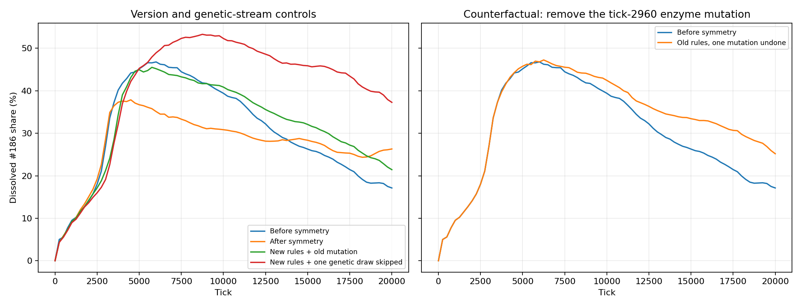

# Causal follow-up: symmetry and #186

Registered September 18, 2026, after the initial
[flow investigation](186-symmetry-investigation.md). The user explicitly requested continued
investigation until there is a supported explanation, rather than another description of the gap.
Plan: `2a39d9ab-c7ba-4f87-a862-297f79d57292`.

## Outcome

The supported explanation is sensitivity of metabolic evolution to genetic history. Symmetry
changed chemical mutation geometry and its consumption of the shared genetic random stream,
therefore changing later neural/body mutations as well. A particular early enzyme mutation
contributed causally to the old run's lower #186: removing that one scalar change under otherwise
unchanged old rules raises its 20k share from 17.13% to 25.18%. Unchanged new rules with one
genetic draw skipped give 37.27%, versus 26.30% unshifted. Static controls find no new general
barrier to the tested alternative pathways. This does not allocate all version effects to RNG
or establish a universal comparison of the two mutation distributions.

## Competing explanations and controls

1. The new rate law changes the advantage of alternative products. Compare old/new work-return
   landscapes for the actual inputs #0/#80, including observed alternatives and product feedback.
   Prediction: advantageous alternatives become weaker or reverse rank if this explains retention.
2. Refitting makes alternative machinery harder to install. Compare matched paid changes under
   the actual old/new algorithms, including competing slots and available work. Prediction:
   alternatives require more work or take longer under the new rule.
3. Isotropic mutation makes useful alternatives less accessible, despite preserved event norms.
   Sample the production old scalar and new vector mutation laws on the same founder offsets;
   measure beneficial proposals and loss of #186 production, not just displacement magnitude.
4. The mutation rewrite changes the shared genetic random sequence, altering neural/body mutations
   and subsequent lineage history. Compare isolated versions with mutation-only interventions;
   distinguish a repeatable directional effect from a particular sequence of genetic opportunities.
5. Weathering at the edges changes the food supply. #0/#80 are boundary species. Quantify changed
   source/field turnover before deciding whether a spatial intervention is justified. Existing
   evidence: cumulative source conversion falls from 33.99 to 17.08 by 20k, against 10506.69 total
   source delivery. A small total does not exclude localized effects, but is not a large supply loss.

## Execution budget and escalation

First use zero-World-tick work landscapes, at most 400000 proposal samples per input, and
bounded direct refit steps (at most 1000 intervals per fixture). Use shared production code,
check diagnostic arithmetic against its compiler, and read the archived lineage/phenotype history.
No mutation, private learning, population replacement or evolution runs in these static comparisons.

If those controls do not explain the trajectory, use isolated diagnostic source copies and the
ordinary WASM World, never a new live compatibility mode or checkpoint adapter. Declare each
source change and preserve source/binary hashes. Each evolutionary intervention first runs a
3000-tick pilot with a 120-second wall cap, then may continue the same state to 20000 ticks with
a total 600-second cap if accounts and provenance pass and the late-turnover question remains.
At most three new trajectories, one fixed world seed (27), 60000 World ticks and 1800 simulation
seconds in total; at most 2 GiB of new result artifacts, excluding reusable compiler build cache.
No seed sweep or automatic extension beyond 20k. Stop on account failure, extinction, storage
limits, horizon or wall cap. Record which contrasts ran and why before escalation.

The existing v20/v21 trajectories are controls. New trajectories must isolate a named intervention
or a named random-sequence control. A single endpoint cannot establish a universal distributional
effect. The intended decision is which changed mechanism needs correction or further focused
testing; no #186-specific rule, evaporation tuning or production-law change is part of this work.

## First evolutionary contrasts

Static controls find no new barrier to the observed alternatives: the product ranking is unchanged
at integer offsets, refitting #233 is cheaper, and beneficial proposals leaving #186 are more
frequent under the new mutation geometry for food #0. Therefore run two declared contrasts:

- `old-mutation`: current v21 physics with only `Machinery::mutate` returned to the old scalar
  procedure. This changes both geometry and random draw consumption; it does not isolate geometry.
- `rng-shift`: unchanged v21 rules and mutation distributions, but advance the initial genetic
  random stream by exactly one draw. Geography, environment randomness, chemistry and initial
  organisms remain identical. This is a sensitivity control, not another world seed.

Build copies under ignored `frontend/harness/artifacts/186-causal-builds/`; do not modify or
publish the production source/binary. Start each with the registered 3000-tick pilot. If it passes,
inspect evidence before continuing the same checkpoint for at most 17000 further ticks and
480 seconds. Pilot plus continuation therefore cannot exceed 600 seconds. The third allowed
trajectory remains unassigned until results identify a useful discriminating control.

Both pilots complete and pass accounts. `old-mutation` starts from a byte-identical physical
checkpoint to the existing v21 control; `rng-shift` differs only in the nine encoded bytes of
the initial genetic random state. Configurations and chemical definitions are identical.
At 3000 ticks, #186 shares are 21.23% and 19.12%, versus the existing control's 28.64%.
These early differences do not answer the late-turnover question. Continue both exact pilot
checkpoints to the registered 20k horizon, with 480-second continuation caps. Ledger pilots:
4020 and 4021. Source digests are retained in their result files.

The archived old population changes a third enzyme toward #218. Its pure-substrate catalytic
work rate is 4.18% lower than #186 but its work per consumed material is 15.82% higher, unchanged
by symmetry at these integer endpoints. Add twelve zero-World-tick production reaction/stress
intervals: #186/#218/#233 outputs, with 0 or 0.4 intracellular #186, and founder versus
product-matched membrane. Keep source #0 at 0.4 and one equally funded enzyme. This tests the
product-feedback and tolerance tradeoff behind the observed alternatives; it is not a fitness assay.

## Final discriminating contrast

Both 20k interventions complete. Old mutation under new physics gives 21.44% #186; one initial
genetic draw skipped under completely unchanged new laws gives 37.27%, versus 26.30% in the
new control. The unchanged-law spread exceeds the original 9.17-point version difference.

Complete organism ancestry locates a specific old-run event: organism 1167, genotype 1120,
born at tick 2960 from organism 887/genotype 840. Its third enzyme changes dx from
10.990189315032723 to 12.685548984012438, with dy=10 and recognition=(0,0) unchanged.
All 200 old 20k cells led by lifetime product #218 descend from this organism. Genotype
archives omit some short-lived ancestors; the named parent and child are both present.

Use the third allowed trajectory to remove only that dx mutation in an isolated original-v20
build. Keep all random draws and every other inherited value. Assert the exact genotype ID,
parent, birth tick and old/new allele values at intervention. First verify the unmodified build
against the archived original kernel. Restore its archived tick-2500 checkpoint; a 500-tick pilot
must reach the intervention at 2960 and tick 3000 with valid accounts, then it may continue to
20k for 17000 ticks/480 seconds. This uses 17500 new World ticks, keeping the entire follow-up
below 60000. It tests whether this actual mutation contributed to the successful history; it
does not prove chemical selection independently of the rest of its inherited phenotype.

The unmodified historical build is byte-identical to the archived v20 WASM (SHA256
`739783242a19ac655b69ad2f542af981cc3aeca59916bb7e6edd0a66bfe36a79`). The intervention
pilot completes at tick 3000 with 351 cells and valid accounts (ledger 4024). Its assertions
pass; genotype 1120 retains the parent's dx=10.990189315032723. Proceed with the exact pilot
checkpoint to 20k under the declared continuation budget.

## Completed mechanism evidence

### Mutation access and installation

The zero-tick diagnostic samples 200000 proposals per law per input, using the actual scalar
and vector mutation routines. These change one enzyme offset pair while holding recognition
and stock fixed. A potentially beneficial escape proposal has less than half its product as
#186 and more than 1% greater catalytic work return under equal, product-free substrate loading.
This is a conditional enzyme measure, not organism fitness.

| Input | Old law and rates | New law and rates |
| --- | ---: | ---: |
| #0: beneficial escape proposals / 200000 | 1425 (0.7125%) | 2526 (1.2630%) |
| #80: beneficial escape proposals / 200000 | 2512 (1.2560%) | 2629 (1.3145%) |

This does not make the new distribution universally better. Expected positive work-rate gain
over all proposals rises about 5.5% for #0 but falls about 12.6% for #80. The measured result
rejects a simple lack of large/useful #0 departures as the explanation for the dominant late
#0→#186 flow. Full recognition, body and controller mutations remain additional inherited changes.

All 512 integer source/product endpoint scores (two inputs × 256 products) agree exactly
between old and new attenuation. Fractional/reflected representations can change rates, as the
earlier frozen-population comparison showed. The formula is checked against the production
compiler. For 64 matched refit fixtures, the new rule never costs more or prevents a completion
that the old rule permits. #0→#233 costs 0.06325 rather than 0.08 work and completes in 16 rather
than 20 physiology intervals when adequately funded. New installation cost is not the barrier
in these fixtures.

### Shared genetic random stream

Ordinary inheritance mutates the neural controller, physical body, then chemical machinery
using one genetic stream. The unchanged parent and initial stream produce these direct calls:

| Offspring call | Old total draws | New total draws | Neural/body values equal? |
| --- | ---: | ---: | --- |
| First | 21 | 36 | Yes / yes |
| Second | 19 | 38 | No / no |
| Third | 23 | 32 | No / no |

The chemical mutation rewrite therefore changes subsequent neural/body mutations even though
their formulas and constants are unchanged. A fixed world seed no longer pairs the same
genetic opportunities between versions. Changes in reproduction times and parent survival
subsequently change which organism receives those opportunities as well.

The fixed-law control skips one initial genetic draw and changes nothing else. Its 20k #186
share is 37.27% versus 26.30% in the unshifted run, a 10.97-point difference exceeding the
9.17-point original version difference. Its 10k–20k #186 production share is 46.83%, versus
30.34% unshifted. Thus random-history sensitivity is demonstrated in the same chemistry,
geography, physical equations and mutation distributions, not merely asserted as an excuse.
This one sensitivity control does not estimate the full outcome distribution.

### Actual inherited pathway and its opportunity

At 20k, 200/650 old-run cells have #218 as their largest lifetime enzyme product, all in founder
lineage 16. Their third installed enzyme averages offset (12.846, 9.766) with mean stock 0.0303.
The new run has 427/627 cells led by #186; their third enzyme averages (10.957, 9.937) with stock
0.0416. These are descriptive product groups, not certified ecological strategies.

Complete organism ancestry connects all 200 old #218-led cells to the tick-2960 mutation
specified above. Its dx jump is 1.69536 chemical units. Both the parent and child are archived,
so the changed allele is directly observed rather than inferred from the endpoint mean.

In production reaction/stress probes with equal enzyme stock and 0.4 material of food #0:

| Intracellular #186 | Work from #0→#186 | Work from #0→#218 | Difference |
| --- | ---: | ---: | ---: |
| 0 | 0.012975 | 0.012433 | #218 is 4.18% lower |
| 0.4 | 0.006753 | 0.012160 | #218 is 80.06% higher |

Each interval lasts 0.8 model seconds. Accumulated #186 inhibits the enzyme producing it;
the alternative largely escapes that occupancy penalty. Its work yield per unit consumed is
also higher: 5.34059 versus 4.61126. A membrane changed to tolerate #218 loses protection from
the existing #186 pool, so metabolic, transport and tolerance changes have coupled costs.
These measurements establish a conditional advantage and its tradeoff; they do not prove that
this enzyme allele alone explains every descendant's reproductive success.

### Food weathering

The boundary correction roughly halves source conversion, but the change is 16.91 material
against 10506.69 delivered by 20k (0.161%). Combined food consumption is slightly higher after
symmetry, not lost: about 7968.68 versus 7735.80. Local environmental selection could still
change, but the evidence does not support a large missing-food pressure as the main mechanism.

Raw reduced operator, feedback, inheritance and ancestry measurements are in
`docs/evidence/digital-chemistry/186-causality/`.

## Final counterfactual result

The allele-removal continuation completes at 20k, within its 480-second cap (ledger 4025).
All sampled accounts pass. The pre-intervention environment and summary at tick 2750 match
the archived original exactly. The altered genotype at tick 3000 differs from its archived
counterpart in exactly one scalar, enzyme slot 2's dx; every other inherited value is identical.

| Same world seed, outcome at 20k | Dissolved #186 share | #186 amount | #186 share of enzyme output, 10k–20k |
| --- | ---: | ---: | ---: |
| Original v20 | 17.13% | 335.61 | 17.78% |
| Original v21 | 26.30% | 533.39 | 30.34% |
| V21 with old mutation procedure | 21.44% | 437.48 | 26.05% |
| V21, one initial genetic draw skipped | 37.27% | 733.36 | 46.83% |
| V20, only the tick-2960 dx mutation undone | 25.18% | 498.70 | 29.73% |

Removing the mutation increases absolute #186 by 48.6% and late #186 production from 512.14
to 896.28 material. This is not just a changed denominator. The original mutant organism has
498 living descendants out of 650 at 20k, including all 200 cells led by product #218.
The intervention establishes that its changed allele contributed to the original low-#186
history. Its effects include subsequent reproduction, competition and allocation of random
opportunities; this is not an additive attribution of a percentage of the whole version gap.

### Causal interpretation

1. Founders start with four enzymes directing the two supplied foods toward #186, plus a
   compatible membrane and transport machinery. The death-material repair removes compulsory
   #186 return; it does not remove that inherited starting bias.
2. Other products can pay. The observed #218 pathway has higher yield and escapes inhibition
   from accumulated #186, while carrying different throughput and tolerance costs. Those
   opportunities remain under the new laws.
3. The older history acquired a substantial third-enzyme shift at tick 2960. Its descendants
   became a large part of the population and redirected production. Undoing that change delays
   the decline of #186 despite retaining all old mathematics.
4. The symmetry rewrite changes both chemical proposals and the future random sequence of
   neural/body mutations. The resulting different branches need not make the same metabolic
   departures on the same schedule. A distribution-preserving one-draw control produces an
   even larger #186 difference with no mathematical change at all.

Thus the working hypothesis is that this apparent regression primarily reflects which early
metabolic variants establish and expand, rather than a new mathematical preference for #186.
This is supported by an actual allele intervention, random-sequence control and retained
mechanistic opportunity. It is stronger than simply saying the runs are stochastic.

The controls do not prove zero effects from altered rates, refitting, motion or weathering on
selection, nor compare outcomes at 228k or estimate their probability over repeated histories.
There is no basis here for a #186-specific sink, stronger evaporation or rolling back symmetry.
The underlying design concern is how reliably local conditions reward departure from the
founder's metabolism; the prior single successful history cannot establish that reliability.

## Closeout and reproduction

All three new trajectories finish their declared horizons: 57500 total World ticks, 1057.63
simulation seconds and about 393 MiB of result artifacts, below the registered budgets.
No experiment remains running. Ledger rows 4020–4025 record pilots and continuations.
The production WASM remains unchanged at SHA256
`01d0573e28de08af73e2357e69734a883890060af59a08b76ff8547b316b76ca`.

- [Population measurements and binary/source provenance](evidence/digital-chemistry/186-causality/findings.json)
- [Operator and mutation measurements](evidence/digital-chemistry/186-causality/operators.json)
- [Product feedback](evidence/digital-chemistry/186-causality/feedback.json)
- [Inheritance stream comparison](evidence/digital-chemistry/186-causality/inheritance.json)
- [Recorded ancestry of the #218 group](evidence/digital-chemistry/186-causality/old218-ancestry.json)

Use `engine/examples/symmetry_causality.rs` for the static controls (`definition.json
NEW_REPORT.json`, optionally `feedback`), and `engine/examples/genetic_stream_probe.rs` for
three ordinary inheritance calls. Diagnostic build source is retained locally under
`frontend/harness/artifacts/186-causal-builds/`; its changes are declared above. These copies
are not runtime options or supported checkpoint adapters. The original historical build was
reconstructed from commit `f48943c` and verified byte-for-byte before the one-allele intervention.

The shared `chemicalInvestigation.ts` runner records all trajectories using the ordinary WASM
World and trace. `python3 frontend/harness/symmetry_causality_report.py` reduces existing
artifacts to a fresh local readout directory; it never advances simulation. `make ci` passes
115 Rust tests and 60 Vitest tests, types, lint, formatting, docs and Terraform formatting.
Thirteen pre-existing ESLint warnings remain. No production simulation rule, default,
deployment or browser state was changed.
