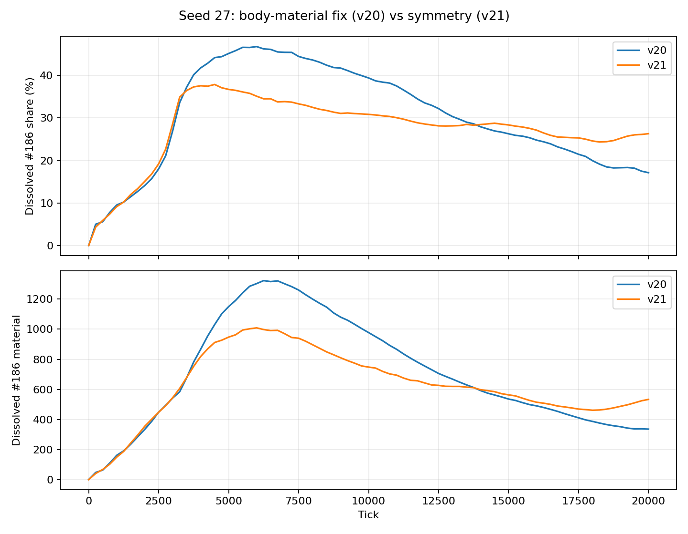

# Investigating renewed #186 accumulation

Registered September 18, 2026. Plan `f0ed1bb2-4302-427d-815d-a28ca81ed354`.

The successful reference is v20 after preserving body material, not v19's compulsory #186
death return. User saves contain 0.89% #186 at v20 tick 227756 and 17.90% at v21 tick 47412.
These are different ages. Earlier matched v20 evidence at 20k contains 17.13% #186, with
26.97% mean share over 10k–20k. It also records no enzymatic consumption of #186. Keep those
facts alongside the user's later positive result; neither snapshot alone identifies a cause.

Questions and decisions:

1. Are the two living populations producing different waste mixtures, or does altered removal
   explain the standing amounts? Use complete-population reaction/transport flows and body stocks.
2. Did the new kinetics or work allocator directly favor #186 for the same installed machinery
   and inventory? Evaluate each old/new component independently on frozen observed cells. These
   diagnostic arithmetic comparisons do not switch checkpoint versions or advance another solver.
3. Does a matched-age v21 trajectory exceed the archived v20 trajectory, and when? A changed
   mutation stream and selection can change installed pathways independently of immediate rates.
   A single matched seed cannot isolate all long-term contributions or establish inevitability.

No production physics, culling, defaults, founder or kernel version changes are authorized here.
The existing bound-material study supplies the original v20 kernel and 0–20k trace. Actual user
save execution digests have already been verified in the mature-cost study. Restore each save
only with its original kernel. Source replenishment, mutation, private/inherited learning and
transfer settings stay as saved; record full configurations.

Budget and sequence:

- Resume each uploaded state for 300 ticks/60 model seconds under its original kernel, 120 seconds
  per case. Trace existing lineage chemical flows and aggregate all living free/bound material.
  Capture one initial assay frame per case for frozen machinery/inventory comparisons.
- Zero World ticks for four old/new kinetic/funding combinations on those frozen cells plus
  founder and historical v20 20k cells if needed. Verify the current arithmetic against the
  production operator and material/reference accounting. Inspect weathering's #186 neighborhood
  and refit/mutation definitions rather than launching whole-world ablation campaigns.
- Fresh v21 seed 27 pilot: 3000 ticks/120 seconds, samples every 250 ticks. Check initial
  config/chemistry against archived v20, accounting and artifact growth.
- Conditional matched-age comparison: if pilot passes and the historical-window question
  remains unresolved, one fresh v21 run to 20000 ticks/600 seconds, matching the existing v20
  comparison horizon. This horizon addresses evolved pathway turnover, already demonstrated
  by the earlier study; it is not a search for waste use. No automatic extension, seed sweep
  or factorial population campaign. Record the escalation decision before starting.
- Total ceiling 23600 ticks/960 seconds of simulation, excluding builds/readout; 1 GiB new artifacts.
  Stop on extinction, account failure, declared horizon, wall cap or resource limits. Existing
  negative results remain negative. Use the ordinary trace, package codec, resource/account
  guards and ledger; retain reduced samples rather than every genome/private-state frame.

## Pilot and escalation

Both 300-tick mature traces complete with valid accounts. v20 produces 1.871 #186 material
out of 105.961 total reaction output; v21 produces 26.447 out of 118.123. #186 consumption is
9.66e-12/zero. Thus the two populations have different actual metabolic outputs; disappearance
of #186 in the old save does not require #186 consumers. The v21 source is ordinary metabolism.

The v21 pilot (ledger 4018) completes 3000 ticks in 15.93 seconds with 378 living cells. Configuration
and chemistry exactly match the archived v20 study. #186 is 544.39 material/28.64% versus
v20's 542.19/26.97% at 3000. Its absolute early accumulation is nearly unchanged. Accounts pass
and reduced output fits the budget. The later evolutionary-window question remains unresolved:
proceed with the one registered 20k v21 comparison against the existing v20 observations.

## Saved-population mechanism

The original binaries match each save's last execution digest. Both saves have the same
configuration and chemical definition. Ledger rows 4016 and 4017 record the 300-tick continuations.

| Whole-population measurement over 300 ticks | v20, starting at 227756 | v21, starting at 47412 |
| --- | ---: | ---: |
| Total enzyme product material | 105.961 | 118.123 |
| #186 enzyme product material | 1.871 | 26.447 |
| #186 share of enzyme products | 1.77% | 22.39% |
| #186 enzymatic consumption | 9.66e-12 | 0 |
| #186 export | 1.387 | 23.306 |
| Dissolved #186, beginning → end | 15.418 → 16.277 | 394.688 → 395.081 |
| #186 share of initial bound body material | 0.83% | 3.65% |

The newer population makes #186 mainly through #0→#186 (17.344 material) and #80→#186
(9.076). The older population's largest output species are #233, #234, #235, #217 and #216.
Its low #186 abundance accompanies production of different waste, not meaningful consumption
of #186. The death-material fix remains intact: death returns actual free and bound mixtures.

The newer population continually replenishes a standing stock rather than rapidly accumulating
more #186 during this short window. Export is 23.306 material over 60 model seconds; washout
alone would remove about 22.98 from the initial dissolved stock over that duration. That
estimate is not a complete species balance: death, weathering and changing concentrations also
contribute. It explains why substantial ongoing production can coexist with a nearly flat stock.

## Frozen-cell mechanism comparisons

The diagnostic example evaluates one physiology interval on each observed cell with installed
machinery, funded stocks, inventories, damage and energy fixed. Four combinations independently
switch catalytic attenuation and reaction funding. It advances no World ticks and does not
convert checkpoints. Current arithmetic agrees with production `metabolism::react` to less than
6e-17, including produced/consumed material and net work; aggregate material balance also passes.

| Fixed observed population | Old rates + old funding | New rates + old funding | Old rates + new funding | New rates + new funding |
| --- | ---: | ---: | ---: | ---: |
| v20: #186 share of enzyme output | 1.752% | 1.815% | 1.752% | 1.815% |
| v21: #186 share of enzyme output | 23.708% | 22.376% | 23.708% | 22.376% |

Changing immediate kinetics does not turn the older machinery into a major #186 producer;
restoring old kinetics does not turn the newer machinery into the older low-#186 phenotype.
New kinetics slightly increase absolute #186 output in the newer cells, but increase other
products more. The funding correction has no measured effect in these frozen states. This does
not rule out effects on earlier survival or selection.

Weathering's duplicate-edge correction does not directly change #186's incoming or outgoing
coefficients: #186 and all four immediate neighbors are interior chemical coordinates. Effects
elsewhere can still change the medium over time. The available evidence locates the main
difference in the populations' installed metabolic pathways. It does not isolate whether
mutation geometry, changed random draws, refitting, movement, indirect weathering or age drove
that difference. Those remain distinct hypotheses, not established causes.

## Matched-age trajectory

Ledger 4019 reaches 20000 ticks in 479.38 seconds, within the registered 600-second limit.
All sampled accounting checks pass. Final material/energy residuals are 1.51e-7 and -9.12e-9.
The archived v20 and new v21 runs use seed 27 and identical initial configuration and chemistry.
Changed mutation draws and subsequent events mean this is a comparison of complete versions,
not a controlled isolation of one changed operator.

| Tick | v20 #186 material | v21 #186 material | v20 dissolved share | v21 dissolved share |
| --- | ---: | ---: | ---: | ---: |
| 3000 | 542.19 | 544.39 | 26.97% | 28.64% |
| 5000 | 1150.37 | 947.43 | 45.15% | 36.71% |
| 10000 | 977.40 | 748.07 | 39.40% | 30.83% |
| 15000 | 535.52 | 563.35 | 26.27% | 28.35% |
| 20000 | 335.61 | 533.39 | 17.13% | 26.30% |

The newer run initially accumulates less #186, then retains more. At 20k it has 58.9% more
#186 material and a 9.17 percentage-point larger share. Mean share over 10k–20k is close:
26.97% in v20 versus 27.44% in v21. The difference is the later trajectory, not a uniformly
worse entire window.

| Reaction production window | v20 #186 / all products | v21 #186 / all products |
| --- | ---: | ---: |
| 0–10k | 2721.50 / 4897.51 (55.57%) | 2210.45 / 5022.64 (44.01%) |
| 10k–20k | 512.14 / 2880.80 (17.78%) | 913.44 / 3010.94 (30.34%) |

During 10k–20k, v20's largest individual pathway is #0→#218 (363.94 material), whereas
v21's is still #0→#186 (643.49). V20 also makes 353.22 through #80→#186 and 158.24 through
#0→#186; v21 makes 269.29 through #80→#186. This specifically identifies continued #0→#186
processing as the major difference in late #186 production.

V21 does briefly consume #186: 19.34 material during 0–10k and 1.28 during 10k–20k, about
0.66% of its total #186 production over the run. V20 consumes none in this historical window.
That small, declining flow does not explain the old run's improvement or establish a sustained
waste-using population. The zero-consumption result above applies to the newer mature-save trace,
not every point in its earlier history.

## Attribution and next decision

The concern is supported: the symmetry version has more #186 at the same 20k age, as well as
more in the later uploaded snapshot. The successful v20 result came from organisms switching
their metabolic output, followed by removal of old waste. The symmetry trajectory shifts less
of its late processing away from #186. This is not evidence that the body-material fix reverted.

The controlled arithmetic comparison rejects a large immediate #186 production bias as the
explanation for the mature population gap. It does not rule out small kinetic differences
changing selection over generations. The refit changes, mutation geometry/random sequence,
movement and indirect environmental effects also changed together. This investigation cannot
attribute the evolutionary divergence to any one of them or show that it persists at 228k.

The next useful test is a short comparison of the observed #0→#186 and alternative-output
machinery under old/new catalytic and paid-refit rules, with starting stocks and controller
effort matched. Measure work returned, refit expense and completion before population outcomes.
That can separate a changed advantage or installation cost from changed evolutionary discovery.
Do not add a #186 exception or increase evaporation on the strength of this result.

Only diagnostic harness/example code, evidence, the ledger and this report were added for this
investigation. Production simulation rules were not edited. `make ci` passes: 115 Rust tests,
60 Vitest tests, formatting, lint, types, documentation and Terraform formatting; 13 existing
ESLint warnings remain. No browser motion certification or deployment was performed.

## Evidence and reproduction

- [Reduced measurements and frozen-cell comparisons](evidence/digital-chemistry/186-symmetry/findings.json)
- Original v20 history: [bound-material impact study](bound-material-impact-study.md).
- Local complete artifacts: `frontend/harness/artifacts/186-v20-mature/`,
  `186-v21-mature/`, `186-v21-pilot/` and `186-v21-common/` under the same artifact root.
- Investigation runner: `frontend/harness/numerical/chemicalInvestigation.ts` accepts
  `mature|pilot|common ORIGINAL_WASM package.gz|27 NEW_OUTPUT_DIR` through `pnpm exec tsx`.
- Frozen-rate diagnostic: `cargo run --manifest-path engine/Cargo.toml --example
  chemical_rate_comparison -- definition.json initial-cells.json NEW_OUTPUT.json`.
  Use the saved definitions and assay frames in the mature artifact directories.

No experiment is pending. The registered ceiling was 23600 World ticks; all 23600 completed.
The shorter traces, pilot and matched-age run together used about 521 simulation seconds.
