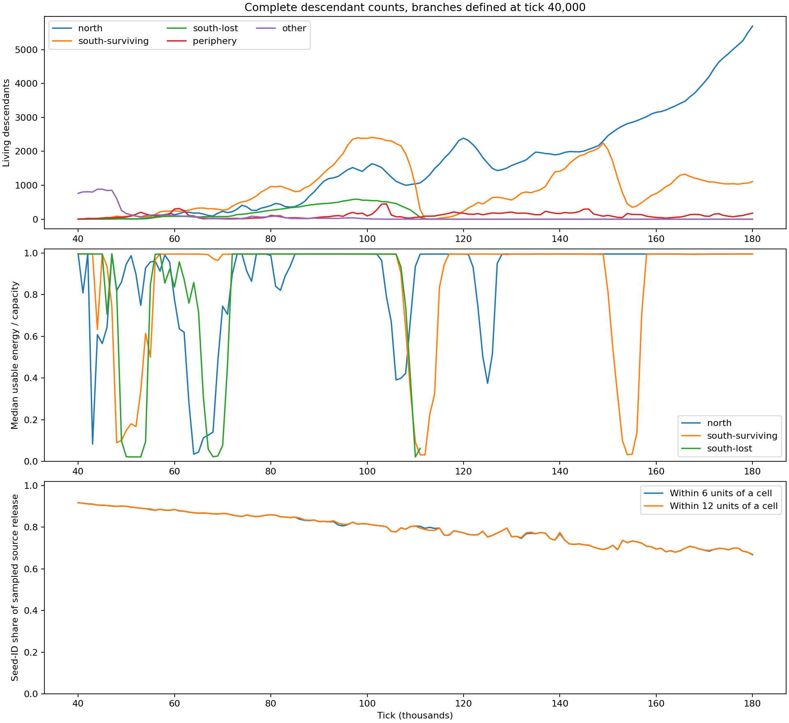

# What the 180k run says about the recent design work

September 20, 2026. Deeper analysis of the stopped seed-27, chemistry-seed-101 v33 run.
The [first report](cellular-200k-review.md) owns registration, accounting, performance and
the interrupted endpoint. This report connects the results to the retrieved design history.
No simulation ticks, formula changes or parameter sweeps were used for this follow-up.

## Findings that change the interpretation

The run has evolved **different metabolic organizations and a strong collective habitat
effect**. It has not yet shown an ecosystem organized primarily around exchanging complementary
chemical products. Most processing in the large colonies recycles material within individual
cells. Those cells substantially change the environmental conditions that make processing pay.
The small peripheral populations use a different, more source-dependent organization.

The southern collapses are episodes of inadequate usable energy despite retained material,
followed by replacement from a surviving branch. The northern colony becomes increasingly
long-lived and slow-turnover. A growing global population hides both events.

One correction matters: the earlier inspector read a temporary body-signal cache immediately
after checkpoint restoration. That cache is empty until stepping rebuilds it. Its reported
`externalDrive` therefore omitted bodies. This follow-up reconstructs current body projections
using the runtime's existing `footprint::visit_current` observer. The earlier numerical example
of local reaction yields is superseded. Recorded accepted reaction flows, stored cell mixtures,
ancestry, light and material/work ledgers remain usable; they did not depend on that calculation.

## 1. Questions recovered from the conversation

Sulion Retrieve searches included user turns, followed by reading the relevant turn bodies.
The session is `01a0a5fc-e982-75c2-8e1d-da4b278ddbf1`; the identifiers below make the
provenance reproducible with `sulion-retrieve turn SESSION TURN`.

| Retrieved turn | Intended outcome or correction | Question answered here |
| --- | --- | --- |
| `224327919` | Clusters are a symptom; the goal is noticeable inherited change and specialization without convergence toward one mean | Do branches retain different functioning chemistry, and do their fortunes change? |
| `261062120` | Material-supported habitats, renewable source composition, shared environmental transformations; no hard-coded 0 beyond seeding | Do inhabited regions alter their medium and source composition? |
| `224344424`, `240507583` | Multiple composed illumination axes and slower periods | Does local illumination alter metabolic opportunity and accompany local die-offs? |
| `83857154` | One heavy-tail mutation formula, separately calibrated physical and neural scales | Does accessible variation produce meaningful changes, beyond genotype counts? |
| `109936143` | Funded physical evolution with competing costs | Which body investments survive, and what costs remain significant? |
| `284887937` | Internal storage, transport and enzymes should interact meaningfully | Does stored chemistry affect active pathways and expressed control? |
| `289117985` | Opportunities rather than prescribed outcomes; clarify overlap and antagonism | What do contacts actually do in this run? |
| `289643798` | Withdraw compartments; retain one inventory and explore organization between cells | Is there evidence of complementary cells or collective dependence? |

The current [design/evidence record](design/decisions-and-evidence.md),
[habitat design](material-habitats.md), [photoreception record](photoreception.md),
[physical coupling correction](physical-coupling-correction.md),
[hypothesis log](hypothesis-log.md) and
[joint cellular design](design/cellular-organization-and-exchange.md) supplied the mechanism
definitions. Earlier unsuccessful public-food probes remain negative evidence. This run does
not retroactively turn those constructed failures into successes.

## 2. Cells are strongly shaping the conditions that power their colonies

At each saved cell position, the runtime combines chemical signals from extracellular material,
finite sources and bodies, then normalizes that vector and multiplies its two channels by local
illumination. The body contribution is actual body mass times the installed membrane's shared
chemical profile. It is not a colony label, density reward or work payment. External work remains
explicitly supplied and accounted.

At 180k, bodies contribute **92.9% of the sum of component-vector magnitudes** sampled by all
cells. Bodies are the largest of the three components for 6,839 of 6,975 cells. That percentage
describes signal magnitudes, not a fraction of energy or a decomposition after signed cancellation.

To evaluate its consequence, hold each saved cell's inventory, machinery, injury and activity
fixed and evaluate its occupied reaction rows with the existing work equation. These are
**requested reaction-work rates before energy and substrate reservations**, not accepted flux
or the outcome of removing cells from a running world.

| 180k branch | Cells | Current work-rate opportunity | Omit all body signal | Omit only recipient's own body signal | Omit external work |
| --- | ---: | ---: | ---: | ---: | ---: |
| North | 5,691 | 229.864 | 58.165 | 228.438 | -15.744 |
| South | 1,109 | 31.056 | 21.081 | 30.798 | -3.372 |
| Periphery | 175 | 1.261 | 1.263 | 1.260 | 1.070 |
| All | 6,975 | 262.181 | 80.509 | 260.496 | -18.046 |

Rates are usable work per model second under frozen requests. Omitting all bodies reduces
the combined opportunity by **69.3%**; omitting each recipient's own contribution reduces it
by **0.64%**. Neighbor-supported environmental conditions are doing substantial work in the
large colonies. The peripheral branch receives almost none of this particular benefit.

This supports a collective habitat mechanism, even though direct neighbor feeding is small.
It does not establish evolved cooperation: a cell can incidentally improve the medium while
pursuing its own metabolism, and no individual-removal survival experiment was performed.
Positive feedback is a credible explanation for the dense colonies: more compatible bodies
change the medium in a direction that funds their chemistry. Whether that feedback ultimately
stabilizes or crowds out alternatives remains unresolved.

There are two distinct effects of body chemistry. The public projection uses the **installed
membrane profile** and body mass. The intracellular rate modifier uses **actual free and bound
chemical identities**. Treating those as the same reduction would misdescribe the implementation.

## 3. The southern crash selects a different surviving organization

Complete ancestry separates the two southern families present at 100k. One has 2,383 cells;
the other has 558. At 110k these fall to 1,001 and 165. The latter family disappears. At 114k
only **four** cells of the surviving family remain; it later reaches 1,109 at 180k.

The energy shortage is not equivalent to empty storage:

| Surviving southern family | 100k | 110k |
| --- | ---: | ---: |
| Median usable energy / capacity | 0.995 | 0.093 |
| Median free material | 0.0647 | 0.1085 |
| Mean free material | 0.0852 | 0.1963 |
| Median fraction of storage filled | 0.125 | 0.204 |

The northern branch already recovers to median energy fraction 0.936 at 110k. The southern
family's median local illumination is near its minimum; under frozen 110k chemistry, replacing
illumination with its neutral value of one raises the family's work-rate opportunity from
**6.57 to 24.71**. The same comparison for north is **12.23 to 17.53**. These calculations
isolate an immediate effect of the existing light equation. Together with rising stored material,
they support lost conversion opportunity as a major contributor to the southern energy crisis.
Changes in available chemical identities, repair and source cycling can contribute too.

All four 114k survivors descend from cell **122921**, alive at 110k with energy fraction 0.996
and motor/core stock ratio 0.0327, while the family's median motor stock is zero. Its recorded
lifetime uptake is 66.5% chemical 0, with 48 the next largest input. Recovery therefore did not
require an exclusively waste-fed survivor. The 180k southern population descends through two of
the four 114k cells: **1,081 descendants of 129532 and 28 of 129533**. This is a specific
surviving evolutionary branch, not replacement by a fresh founder or an unrelated northern migrant.
The data do not isolate motor investment as the sole cause of survival.

After recovery, north and south maintain different processing distributions. Define overlap
as the sum of the smaller normalized consumption shares for each chemical: identical
distributions score one, disjoint distributions zero. North versus the surviving southern
family falls from **0.610 at 100k** to **0.043 at 130k**, **0.047 at 150k**, and **0.066 at 180k**.
At 180k their dominant sets are respectively **119/120/135/136** and **80/96/112/128**.
These are lifetime consumption records of the cells alive at each checkpoint; they establish
expressed differentiation, not a complete accounting of every cell that died between snapshots.

The second southern decline repeats an energy-with-material pattern: at 155k its median energy
fraction is 0.034 while median storage fill is 0.271. Global growth conceals that local collapse.

## 4. Three organizations persist, but their evolutionary turnover differs

| 180k branch | Dominant processing | Median motor/core | Median enzyme/core | Median age, ticks | Divisions per 1,000 cell-ticks, 170k–180k |
| --- | --- | ---: | ---: | ---: | ---: |
| North | Four-chemical internal cycle | 0.0301 | 0.290 | 8,060 | 0.052 |
| South | Different internal cycle | 0.0224 | 0.331 | 4,920 | 0.140 |
| Periphery | Predominantly chemical 0 | 0.1490 | 0.163 | 424 | 0.691 |

Cell-ticks integrate the exact time every descendant was alive, including those that died.
The peripheral branch divides about **13 times faster per living-cell exposure** than north
in that interval. It also dies faster: 0.620 versus 0.018 deaths per 1,000 cell-ticks.
The large colony's success increasingly consists of persistence, not simply rapid replacement.
Median generations are 163 north, 192 south and 207 periphery.

This is meaningful specialization with different body investments and demographic behavior.
It also explains why the screen can look stable while some branches continue rapid turnover.
The single surviving original founder label misses all three organizations. Unique genotype
counts also overstate useful information: descendants receive distinct records, and uniqueness
alone says nothing about functional novelty.

The mutation-access hypothesis is no longer well described as cells being unable to leave
their initial chemical neighborhood. Active machinery, program counts and expressed cycles have
changed substantially. That does not measure the probability of every possible major innovation
or establish that the mutation law is optimal.

## 5. Private recycling is much stronger than a division of labor between cells

For each cell, compare its lifetime production and consumption of the same chemicals. The
median fraction of consumption matched by its own recorded production is **98.6% north**,
**98.3% south**, and **0.1% periphery** at 180k. This is an overlap diagnostic, not atom tracing:
inherited stores and simultaneous imports can contribute. Combined with accepted cyclic routes
and low direct exchange, it strongly supports intracellular recycling as the dominant large-colony
organization.

The normalized northern and southern uptake distributions still overlap by **51.6%**, while
their processing distributions overlap by only **6.6%**. Different inherited processing of
partly shared supplies explains more of their distinction than exclusive access to different food.

All **38,071 direct contact edges** at 180k lie within these broad ancestry families: 36,244
northern, 1,792 southern and 35 peripheral. At 100k there were 2,540 contacts between the two
southern families, so different branches did encounter each other before one disappeared.
Within-family variation remains possible; family identity does not establish identical roles.

Direct contact uptake supplies about 2% of cumulative intake, but that is not the full effect
of neighbors. At 180k, **3,408 cells have less than one-quarter of their interface facing the
field**. Crowding limits ordinary uptake/export while collective medium modification improves
conversion opportunity. Those opposing effects are already connected in the living colonies.

The strongest supported interpretation is **self-sufficient chemical recyclers sharing and
altering a habitat**, alongside faster-turnover resource consumers. Complementary multicellular
food processing, deliberate chemical attack and obligate cooperation are not established.
No payoff follows merely from assigning those labels to close cells.

## 6. Intracellular chemistry matters, but has not forced strong pathway specialization

About **85% of retained material is bound body material** in both large branches at 180k.
The median body contribution to the sum of free/bound chemical-moment magnitudes is 88.2%
north and 86.8% south. Construction history therefore strongly influences the internal chemical
environment. Storage is not an isolated scalar, and bound identity is not forgotten at assembly.

Nevertheless, when weighted by occupied rows, funded enzymes and their requested activity,
the actual mixture changes aggregate requested conversion rate relative to a neutral modifier
by only **-1.1% north** and **-0.4% south**. Individual pathways are stimulated and inhibited;
those effects largely offset in their complete repertoires. The peripheral branch instead
experiences a **27.3% rate reduction**. The shared formula has different consequences for the
different organizations.

Work can change even when total throughput barely changes, because different rows earn different
amounts. At 180k the mixture increases northern frozen work opportunity by 3.7%, decreases
southern opportunity by 1.3%, and decreases peripheral opportunity by 34.4%. These are current-state
arithmetic comparisons, not evolved fitness effects or outcomes of running without the coupling.

Inward sensing has become connected to funded actions. Removing inward readings changes a funded
enzyme-activity request by more than 0.01 in **235 northern cells** through one enzyme port.
Removing light readings changes a funded transporter request by that amount in **1,416 northern
cells**. Effects on motion, repair and construction also exist. These controlled neural reads
establish expression; their benefit over an organism's lifetime remains unmeasured. The earlier
inspection found only 39 cells with large selective activity differences across funded enzymes.

There is a concrete reason why elaborate scheduling may not pay much in favorable periods:
**63.5% of net reaction work in 170k–180k is discarded as capacity overflow**, while expenditure
on uphill reactions is small. Intracellular cycles avoid transport and partner dependence.
The new mixture tradeoff has not made their total processing markedly inefficient.
This explains a weak pressure toward exchange-dependent specialization without assuming mutation
must be too weak or prescribing that cells ought to cooperate.

The earlier H2 concern also remains precisely bounded: cells differ in stock allocation,
retained-mixture rates and local work conditions, but still share work per accepted conversion
at identical external conditions. This feature introduced no inherited conversion-efficiency gene.

Photoreception presently observes mean brightness and its local change/direction, while work
depends on two distinct illumination channels. Collapsing those channels to their mean reduces
the southern branch's frozen 180k work opportunity by 15.4%. Equal brightness can therefore
conceal different transformation returns. Chemical readings can supply additional context;
this observation alone does not establish that another neural input is needed. At 180k the
median absolute directional light inputs are about 0.000076, versus 0.279 for level. Reversing
the gradient changes none of the seven inspected motion/repair/transport outputs by more than
0.01. Light-responsive behavior is present, but useful directional light navigation has not
been established by this run.

## 7. Resource renewal is changing, especially around substantial colonies

The mean seed-ID share of source renewal is insufficient to describe actual local supply.
Using instantaneous source release rates sampled every 1,000 ticks:

| Interval | Seed-ID share of all sampled source output | Share near cells, within 6 units |
| --- | ---: | ---: |
| 0–40k | 96.1% | 94.8% |
| 90k–100k | 83.6% | 82.0% |
| 170k–180k | 73.2% | 69.1% |

These are ratios of equally spaced rate samples, not exact integrated release totals; short
source pulses can fall between samples. At the final snapshot, 15 sources with more than
100 cells within 12 units have mean seed-ID renewal share **62.3%**. The 16 sources with
no cell within that radius average **82.9%**. The intermediate group averages 74.2%.

Renewal is not static, and its shift is strongest near substantial colonies. The snapshot
association alone cannot separate cells changing sources from colonies preferring sources that
changed. The code supplies the local feedback path; both can operate together.

Seed chemicals remain important to material supply. That does not mean they dominate every
cell's energy metabolism. In the large colonies, reused intermediates and externally funded
conversion dominate processing. Globally, public weathering processed 1,793 units and source
conversion 630, compared with about 780,000 of cellular processing. Repeated private cycling
contributes to that disparity. This world has much more intracellular chemical circulation than
abiotic regeneration, even though both use the shared transformation language.

Chemical 186 is not a renewed terminal sink in this run: its maximum sampled standing share
was about 0.075%, and its final share about 0.0044%. Concentration into particular active cycles
is now the more relevant issue than accumulation of that former waste identity.

## 8. Consequences for the project

The positive finding is broader than colony survival: inherited processing diverges, local
energy crises replace branches, source composition changes, and cells substantially modify the
medium that supports them. The existing habitat and illumination work is affecting evolution.

The unfulfilled intracellular/intercellular ambition is more specific: reliable private cycles
remain inexpensive compared with passing intermediates through crowded, lossy interfaces.
An extracellular web is not impossible, but this run supplies little reason for a successful
recycler to depend on a complementary neighbor. Increasing the number of enzymes has mostly
expanded what one cell can do for itself. Meanwhile, collective habitat dependence has appeared
without requiring direct food exchange. These are different routes toward organization and
should remain distinguishable in the design and UI.

The immediate practical blocker remains the measured runtime regression, especially repeated
contact candidate searches in dense colonies. It limits observation of precisely the mature
organizations the new mechanics allow. The simulation's rules were not altered in this analysis.

## Evidence and validation

- [Connected reductions](evidence/cellular-180k/connections.json) preserve 181 source/demographic
  samples, 15 detailed checkpoints, ancestry-root definitions, six frozen arithmetic comparisons
  and validation results. Complete branch population changes reconcile with all recorded divisions
  and deaths in every 1,000-tick interval from 40k through 180k.
- The existing Rust inspector's `--connections` mode reconstructs current derived body signals
  and uses compiled ordinary reaction rows. Every checkpoint inspection asserts that the physical
  snapshot is unchanged. No `World` step, competition or artificial controller was run.
- `frontend/harness/cellular_connections.py` computes the connected reductions from existing
  observations and ancestry. Chemical property tables agree across all supplied inspections.
- Frozen work rates do not account for changed donor competition or subsequent behavior. They
  isolate immediate mathematical dependence, not population survival after an intervention.
- Rebuilt body projections describe current saved positions. The live solver freezes these at
  its own stage boundary; these are not a reconstruction of the preceding substep's exact inputs.
- Snapshot `lastStepFlows` fall on physiology ticks. Reactions/repair cover 0.8 model seconds;
  motion/maintenance cover 0.2. The data retain those totals, but their ratios are not whole-interval
  expense budgets. The first report's interval ledgers supply actual cumulative budgets.
- Body-signal-free diagnostic files are retained locally under
  `connections-omitted-body-invalid` for provenance and excluded from the linked evidence.
  Earlier `inspection/*.json` values of `organization.externalDrive` and the earlier yield example are
  superseded. Other raw observations are preserved.
- Full `make ci` passes with the existing 17 frontend lint warnings. No browser run or new
  evolutionary campaign was started.
