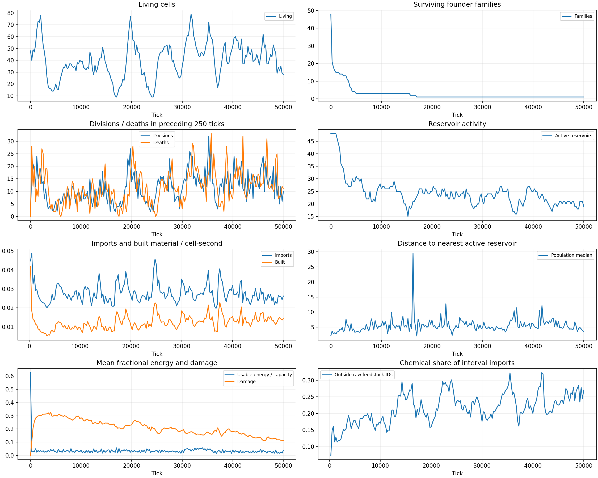
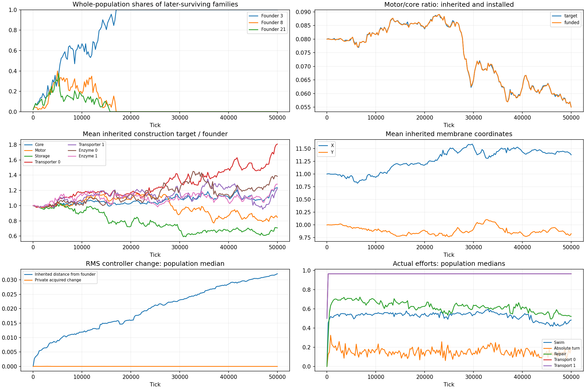
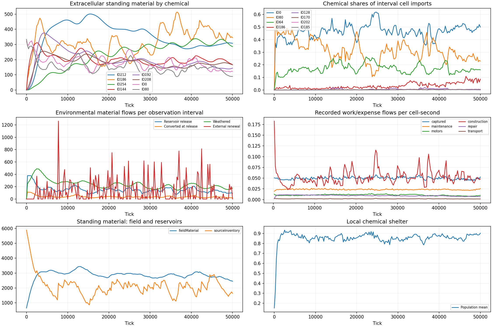
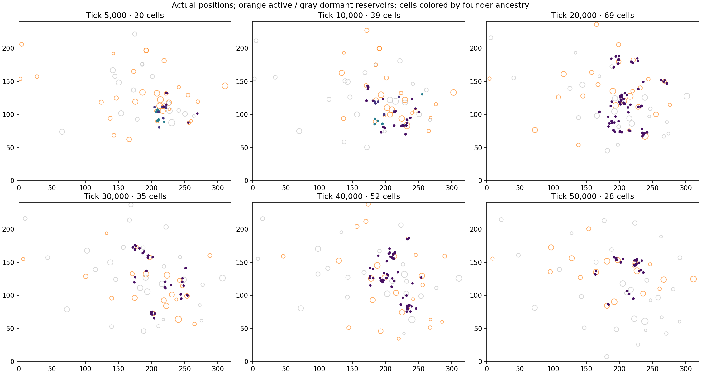

# Default-seed turnover: 50,000-tick observation

September 16, 2026. User-authorized observation of the current implementation before correcting
its mathematical architecture. Plan: `998e9d6d-82aa-4761-8f36-fc97a5aba184`.
The user reports interesting cycles from 5,000–50,000 ticks. This study does not accept the
source-specific or environmental operators as the intended shared mathematical formulation.
Audit and correction of the ecology implementation remain outstanding; no physical rules are
changed during this observation.

## Question and competing explanations

Do local population crashes and rebounds coincide with inherited changes, or do existing
families persist while resource access oscillates? Alternatives include reservoir exhaustion
and renewal, source motion relative to cells, geographic weathering, changing chemical identity,
and shifts in costs or inherited machinery. Several mechanisms may contribute. Distinguish
local extinction from global extinction, genotype replacement from family loss, and drift of
mean traits from an established adaptive benefit.

Read the existing short source results and negative environmental findings first. The two
3,000-tick source confirmations already establish motion, conversion and continued funded access.
The seed27 confirmation ends with39 cells after an earlier peak. The user's observation and the
need to see multiple turnover episodes justify this single longer horizon; no new pilot or
parameter/seed sweep is necessary.

## Frozen conditions and budgets

One new ordinary world, seed27, chemistry101, checkpoint v15, default drift4/processing4,
320×240, mesh2,48 founders in two colonies. Ordinary physical/behavioral mutation and paid
private/inherited learning remain active. Contact transfer and disturbance remain off. Archive
the exact loaded WASM, resolved definition and source hashes. No browser session or server launch.

Advance from zero to50,000ticks once. Sample every250ticks: complete living population positions,
genotype identities and newly observed full genomes; target and installed machinery; ancestry
groups including ended organisms; cumulative species transfers/reaction edges; extracellular
species totals; source inventories, locations, rates and prospective output; costs and accounts.
Inspect up to eight cells per1,000ticks, selected deterministically across surviving founder
families, for local chemistry and actions. This selection affects observation only.

Initial/final checkpoints plus10,000-tick checkpoints retain reconstructable physical states.
Wall cap:1,800seconds. Stop at50,000, global extinction, physical pause, account failure or
resource limits:3GiB RSS,1.5GiB WASM,3GiB case artifacts,4GiB study artifacts,20GiB free disk.
Reserve another1GiB for final export. Estimate ordinary run wall from the prior131–136ticks/s
as about6.4minutes; allow slowdown as chemistry spreads. No automatic extension or second run.

## Analysis and decision

Stream artifacts without keeping full genomes per timestep in memory. Identify population
peaks/troughs with explicit amplitude and timing, report founder-family frequencies against
the complete living population, and follow inherited construction/chemical/controller changes.
Use interval differences for births, deaths, imports, conversions and expenses. Relate local
resource distance and availability to regional populations; compare aggregate and occupied
neighborhood chemistry. Inspect specific genomes before describing their biological meaning.

Deliver local plots and a readable timeline with named quantities, representative genotypes,
chemical pathways, positive findings and unresolved causal explanations. This single unmodified
trajectory can nominate causal probes for the coming rewrite; it cannot establish that mutation,
learning or weathering caused a cycle without interventions. No additional simulation is
authorized by this registration.

## Result: recurrent starvation and inherited change

The unchanged default reached **50,000 ticks in 416.1 seconds**, ending with **28 living cells**
and a maximum living generation of **104**. Ledger **3950** records the completed horizon.
All **2,338 deaths were starvation**; **2,318 divisions** produced 4,636 children. There was no
whole-world extinction or reseeding. Population pulses coexist with substantial inherited change,
but this trajectory does not demonstrate alternating ecological strategies or a periodic attractor.

### Population and ancestry

| Tick | Living cells | Interpretation |
| --- | ---: | --- |
| 5,000 | 20 | Founder families 3, 8 and 21 remain |
| 11,750 | 47 | Recovery before further family loss |
| 17,000 | 9 | Only founder 3's family remains |
| 19,750 | 77 | Large rebound |
| 24,250 | 9 | Another severe trough |
| 27,500 | 53 | Recovery |
| 31,750 | 79 | Largest sampled population |
| 35,250 | 72 | Later peak |
| 37,000 | 17 | Another crash |
| 38,500 | 55 | Recovery; irregular pulses continue |
| 50,000 | 28 | Observation endpoint, not a confirmed trough |

Sampling every 250 ticks can miss shorter extrema. The descriptive reversal detector requires
at least ten cells and 25% change; it does not estimate a cycle period. Peaks and troughs recur
at irregular intervals. The second starting colony disappears at tick 163; founder 21's family
ends at 15,703 and founder 8's at 16,963. All subsequent pulses occur within founder 3's family.

Complete ancestry reveals repeated loss of branches. All 28 final cells descend from cell 1250,
one of nine cells alive at tick 17,000, and cell 1826, one of nine at 24,250. They also descend
from cell 2108, one of 53 alive at 27,500. Their latest common ancestor is cell 3463
(genome 3416), born at 39,124 and divided at 39,536. These are retrospective endpoint-survival
facts: other branches were still alive at those times. They do not identify which allele won
through selection rather than chance survival or position.



### Resource access during crashes

The 17,000–19,750 rebound had 126 divisions and 58 starvation deaths. The following
19,750–24,250 crash had 160 divisions and 228 starvation deaths: reproduction continued
throughout the decline. Interval imports per organism-second fell from 0.03206 to 0.02578
and constructed material from 0.01488 to 0.01029, decreases of 20% and 31% respectively.
World field material increased from 2,698 to 2,969 during the crash.

The later 35,250–37,000 crash likewise had lower imports and construction per organism-second
than its subsequent rebound: 0.02564 versus 0.03195 imports, and 0.01215 versus 0.01632 built
material. Mean energy reserves stay small, typically a few percent of capacity. This supports
local food access and tight individual budgets as explanations worth testing; it rules out
complete exhaustion of world material. It does not separate renewal, motion, competition,
chemical quality or controller behavior. Global reservoir counts and nearest-center distance
cannot establish access to remaining plumes.

### What changed in the genomes and funded bodies

These are whole-population means, not traits of an arbitrarily selected survivor:

| Inherited construction target | Founder | Tick 50,000 mean | Change |
| --- | ---: | ---: | ---: |
| Core | 1.0000 | 1.2357 | +24% |
| Motor | 0.0800 | 0.06772 | −15% |
| Motor/core, mean individual ratio | 0.0800 | 0.05506 | −31% |
| Storage | 0.0800 | 0.05657 | −29% |
| Transporter 0 | 0.0400 | 0.07232 | +81% |
| Transporter 3 | 0.0400 | 0.09895 | +147% |

Motor/core falls especially around 27,500–30,000 ticks and decreases further later. The final
funded ratio is 0.05504, so this is expressed physical allocation, not an unfunded genetic wish.
Mean compiled recognition-weighted capacity for raw chemical 0 rises from 0.0400 to 0.07206;
capacity for 80 rises only to 0.04400. Transporters are bidirectional; larger slot 3 stock
does not by itself mean a new export strategy. Its target remains near the retained metabolic
product neighborhood.

Mean inherited membrane location shifts from (11, 10) to (11.378, 9.827); installed means match.
Mean damage falls from 0.303 at tick 5,000 to 0.114 at 50,000. Comparing 5,000–15,000 with
35,000–50,000, motor expenditure per organism-second falls 15.5%, repair expense 22.9%, and
constructed material rises 36.8%, while captured work decreases 2.6%. Lower motor/storage
allocation, changed chemical handling and lower repair burden form a plausible economical
survival phenotype. Environment, population composition and exposure also change, so these
comparisons do not isolate a heritable fitness advantage. Repair expense includes material
potential loss; it is not solely a usable-energy payment.

Controller genes also change. Median inherited controller distance from the founder reaches
0.03212 RMS; median private acquired recurrent change is 0.00000447 at the endpoint. These
measures cover different parameter sets and do not apportion causal effects. Strong import
effort through the initial two transport slots persists. A plasticity rate allele falls from
0.0200 to 0.008107: it occurs in 3/77 cells at 19,750, 29/35 at 30,000 and 28/28 at 50,000.
The controller uses the absolute allele times dt as its trace-update rate. Its spread could
reflect benefit or linkage to other successful traits; private learning was not disabled.

The compact evidence includes full chemical targets, body alleles, plasticity genes, controller
block changes and largest weight changes for representative genomes. Representatives are chosen
by the median target motor/core ratio, with cell ID breaking ties: genome 689 at 10,000,
2296 at 30,000, 3461 at 40,000 and 4608 at 50,000. They illustrate actual sequences and are
not substitutes for the population means. The local archive retains complete weights for all
3,843 genotypes observed alive at sample times; short-lived genomes between samples can be missed.



### Chemical pathways and occupied neighborhoods

| Interval | Imported ID 0 | ID 80 | ID 64 | ID 186 |
| --- | ---: | ---: | ---: | ---: |
| 0–5,000 | 40.2% | 46.6% | 11.5% | 1.6% |
| 5,000–15,000 | 46.3% | 34.1% | 17.8% | 1.2% |
| 15,000–25,000 | 48.1% | 30.1% | 18.8% | 2.0% |
| 25,000–35,000 | 46.5% | 31.7% | 16.4% | 3.7% |
| 35,000–50,000 | 47.0% | 28.6% | 16.8% | 5.4% |

The two raw feedstocks still supply 75.6% of late imports. Use of transformed chemical 64
is substantial, and reimport of 186 increases, but these are not independent resource cycles.
Chemical 186 is both the principal metabolic product and generic decomposition material.
Reuptake establishes material recycling, without distinguishing self-reimport from neighbors'
products or dead bodies. Imported 64 can originate from environmental or reservoir processing;
the records do not tag atom provenance.

The largest cumulative reaction routes are **0→186: 1,569.85**, **80→186: 1,271.37**,
and **64→170: 608.09** material units. The first two account for about 56% of all reaction
throughput. Routes to nearby products such as 185, 187 and 202 appear as inherited chemical
coordinates change. This is variation around the original metabolism, not evidence for a
replacement food web. Abundant field chemicals 212 and 254 are mostly outside the main diet;
a chemically diverse field does not imply diverse cell strategies.

All-cell reads of the saved checkpoints show that mean local concentrations of raw 0 and 80
fall from 0.00905/0.01234 at 10,000 to 0.00522/0.00521 at 50,000. Local 186 remains abundant
(0.06961 and 0.07126). Occupied neighborhoods retain strong chemical shelter; mean mobility
changes from 0.664 to 0.620. These comparisons describe where survivors are, not a controlled
test of improved membrane compatibility or shelter benefit. Earlier negative shelter-specific
predictions remain negative.

Reservoirs release 30,430.87 material units, converting 7,448.95 at release (24.5%). External
renewal supplies 26,187.97 units over the run. The system remains open and dependent on renewed
feedstock. Chemical weathering and washout continue throughout population crashes.





### Implications for the mathematical correction

Preserve the opportunity for sparse survivors to recover as local food conditions change, and
for funded allocation and chemical compatibility to alter the cost of living. Preserve observable
ancestry loss and material recycling. These are measured phenomena to explain; they do not justify
retaining the source-specific operators, require exact tick counts, or establish that the current
weathering/drift formulas caused them.

The most useful later causal comparison is a small paired test of the observed lower-motor,
changed-transport phenotype under matched food/exposure conditions, after the shared mathematics
is corrected. It can separate economical allocation from accidental location and linked genes.
No such intervention, extra seed, horizon extension or new simulation was run in this study.

## Evidence and reproduction

- [Compact findings, representative genomes and exact configuration](evidence/digital-chemistry/default-seed-cycles/findings.json).
- Local raw archive: `frontend/harness/artifacts/default-seed-cycles-2026-09-16/seed27/`.
  Includes exact WASM, definition, initial state, five 10,000-tick checkpoints, 201 observations,
  observed full genomes and result. Do not rerun the simulation to regenerate figures.
- Full derived timeline: `frontend/harness/artifacts/default-seed-cycles-2026-09-16/report/report.json`.
  `readout/` holds complete ancestry and five all-cell checkpoint readouts. Each readout was
  byte-compared with its original checkpoint after observation; no state changed or ticks advanced.
- Binary SHA256: `e727b950f5dbe8f984784efc1cc8d49fca5221fa6c7c2c72b3339ac35cb06edb`.
  Source digest: `58c9d126a33073d1a275cd0e0b6a5ecefb1cef95fddfe7100fcd2f9e389eb1d8`.
- Peak sampled process RSS: 324.7 MiB; WASM: 202.3 MiB. Maximum absolute material residual:
  1.88e-9; energy residual: 1.48e-7. This headless run does not test browser endurance.

From `frontend`, reuse the saved data with new output paths:

```bash
python3 harness/seed_cycle_report.py harness/artifacts/default-seed-cycles-2026-09-16/seed27 harness/artifacts/default-seed-cycles-2026-09-16/report-review
python3 harness/seed_cycle_findings.py harness/artifacts/default-seed-cycles-2026-09-16 harness/artifacts/default-seed-cycles-2026-09-16/findings-review.json
```

The second command uses the original `report/report.json` and `readout/` directories. Both
readers reject existing output paths. The invariant checks reconcile living counts, cumulative
imports, births and ancestry against the recorded ledger. No full fields or private-state frames
were added to the live browser boundary; the existing offline assay commands supply this study.
