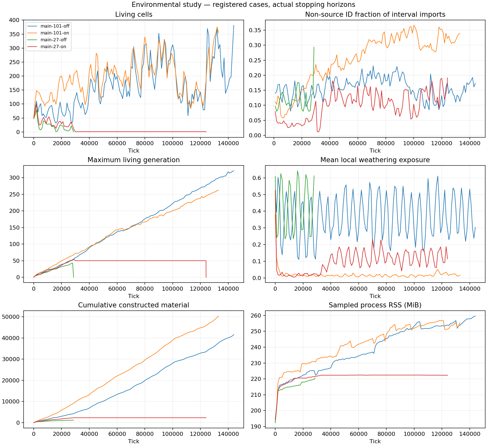

# Environmental study

Chemical identity is not atom provenance. Regions are descriptive. Family size is not a strategy or invasion result. Repair dissipation includes lost material potential; capture minus recorded expenses is the predeclared screening metric, not net usable-work profit. Memory peaks are sampled every1000ticks, not continuous OS peaks.

| Case | Stop | Ticks | Living | Max sampled generation | Non-source ID imports | Ticks/s | RSS MiB |
| --- | --- | ---: | ---: | ---: | ---: | ---: | ---: |
| main-101-off | resource limit: caseBytes | 144,000 | 381 | 321 | 16.14% | 103.9 | 259.6 |
| main-101-on | resource limit: caseBytes | 133,000 | 355 | 262 | 26.11% | 100.5 | 256.8 |
| main-27-off | extinction | 28,691 | 0 | 43 | 10.51% | 142.2 | 220.7 |
| main-27-on | extinction | 124,051 | 0 | 54 | 4.52% | 145.6 | 222.4 |
| pilot-101-off | horizon | 3,000 | 71 | 9 | 14.95% | 154.5 | 216.4 |
| pilot-101-on | horizon | 3,000 | 143 | 11 | 11.55% | 143.6 | 221.5 |
| pilot-27-off | horizon | 3,000 | 36 | 7 | 8.80% | 159.9 | 212.9 |
| pilot-27-on | horizon | 3,000 | 53 | 7 | 5.63% | 157.0 | 229.7 |

Detailed flows, founder denominators, regional stocks and paired matched-tick observations are in report.json.
