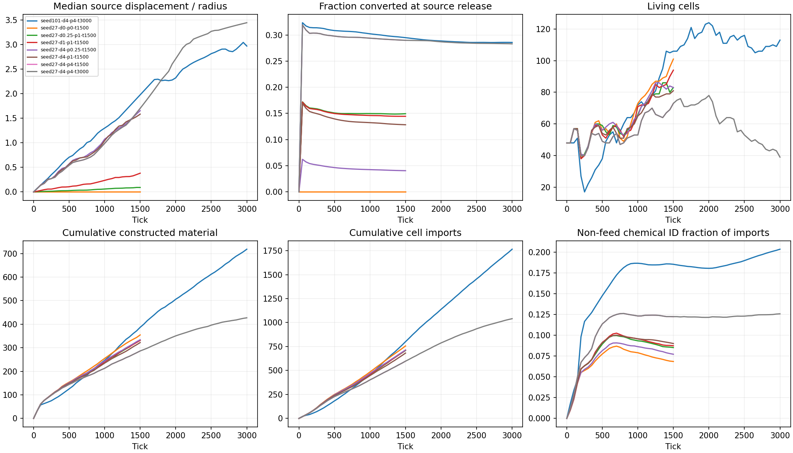

# Short mobile-source study

Short calibration establishes response and access, not evolved strategy or sustained ecology. Prospective output is an instantaneous rate; imports identify chemical IDs, not atom provenance. Memory peaks are sampled.

| Case | Ticks | Stop | Living | Median displacement/radius | Converted release | Built material | Ticks/s |
| --- | ---: | --- | ---: | ---: | ---: | ---: | ---: |
| seed101-d4-p4-t3000 | 3000 | horizon | 113 | 2.973 | 28.57% | 718.51 | 131.1 |
| seed27-d0-p0-t1500 | 1500 | horizon | 101 | 0.000 | 0.00% | 354.55 | 165.8 |
| seed27-d0.25-p1-t1500 | 1500 | horizon | 83 | 0.091 | 14.94% | 331.90 | 151.7 |
| seed27-d1-p1-t1500 | 1500 | horizon | 94 | 0.382 | 14.45% | 331.58 | 150.1 |
| seed27-d4-p0.25-t1500 | 1500 | horizon | 83 | 1.656 | 4.06% | 334.12 | 148.0 |
| seed27-d4-p1-t1500 | 1500 | horizon | 81 | 1.585 | 12.84% | 322.25 | 151.0 |
| seed27-d4-p4-t1500 | 1500 | horizon | 73 | 1.704 | 28.98% | 286.53 | 152.9 |
| seed27-d4-p4-t3000 | 3000 | horizon | 39 | 3.449 | 28.30% | 427.25 | 136.0 |

Exact config, onset times and sampled trajectories are in report.json.
