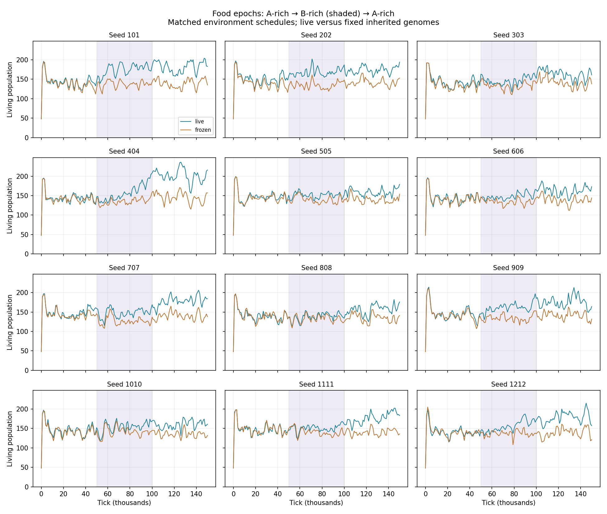
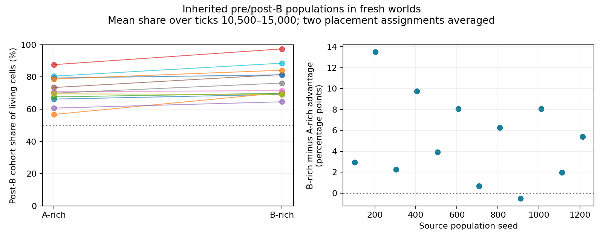

# Food epochs and inherited adaptation

Registered September 11, 2026 before epoch outcomes. Plan
`42504d5b-d0a9-4b0d-a8c9-5504c8a7a0bc` executes the approved food-composition proposal.

## Mechanism

Optional `config.foodEpochs` stores an integer `phaseTicks` and a nonempty list of incoming
food-A fractions. The list repeats. Absence retains the existing heterogeneous mixed deposits;
existing v5 checkpoints need no invented state. Present schedules validate strictly and survive
exact continuation. The current phase follows world tick; no additional clock or randomness exists.

New deposits use the current fraction. Existing inventories and dissolved fields are never
relabelled at transitions. Inventory totals, energy density, location, radius, duration and source
arrival randomness are unchanged. Original composition draws are still consumed, keeping independent
environment schedules matched. The initial uniform food field remains half A and half B.
Decomposition still supplies B, so actual field/absorbed composition need not equal incoming shares.
Controllers receive only the existing local chemistry/body readings, never an epoch identifier.

## Registered population comparison

Twelve independent seeds, 101 through 1212 in increments of 101, each have live and frozen arms.
The frozen arm disables both mutation blocks and acquired-weight transmission from tick zero;
private paid learning remains on. Both arms otherwise use current defaults and identical initial
worlds. Each run has three 50,000-tick phases: 80% A, 20% A, then 80% A again. Total: 24 runs and
3,600,000 requested ticks. No outcome-dependent transitions, rescue, preferred founders or restarts.
Six processes maximum, 45-minute wall cap per run; early extinction/safety stops remain outcomes.

Samples every 1,000 ticks retain population, family, inherited targets, sampled efforts, source state
and cumulative resource ledgers. Checkpoints at 50k, 100k and 150k retain phase-boundary populations.
Primary summaries compare the last 10k ticks of each phase, paired by seed. Report dips and recovery
without treating a rebound as proof of adaptation. Seeds are replicates; samples and cells are not.

After the first pair completed, biomass was added as a secondary reporting check: a larger census
can reflect smaller bodies. It uses existing samples and does not change runs or the registered
primary outcome. It is an exploratory diagnostic, not an additional preregistered endpoint.

The pressure may reveal processing specialization, generalism, or only further removal of costly
founder behavior. No dip, tradeoff, specialist or successful recovery is required for acceptance.
Do not increase severity or tune genes merely because the expected pattern does not appear.

## Inherited population assays

Compare ordinary inherited genomes sampled from all living cells immediately before the B-rich
epoch (50k) and after it (100k). Use an independent seeded sampler with replacement, preserving
population frequencies rather than selecting winners or inspecting genes to choose representatives.
Each assay starts a fresh world with 48 equally funded founder bodies: 24 genomes from each cohort,
fresh recurrent state/task/traces and locally initialized receptors. Changed construction targets
develop through paid growth. Mutation and acquired-weight transmission are off during assays;
private learning remains available to both cohorts and may express inherited learning rules.

Run each source seed under constant 80% A and constant 20% A, with both alternating placement
assignments swapped, for 15,000 ticks each: 48 assays and 720,000 requested ticks. Use the same
sampled genomes across the two placements and food compositions within a seed. Report post-B
population share and its contrast across assay environments, not a selected single-locus story.
Improvement in both environments is consistent with general improvement. B-specific benefit would
support specialization but is not required. This has no stationary-evolving-A time control, so
it does not isolate the selection history responsible for every improvement.

## Execution and boundaries

From `frontend`:

```bash
python3 harness/epoch_batch.py
```

After the population runs finish:

```bash
python3 harness/epoch_assay_batch.py
python3 harness/epoch_report.py
```

The report summarizes the registered phase windows and placement-averaged cohort shares.
Descriptive 95% bootstrap intervals resample twelve seeds, never individual ticks or cells.
An absent assay is reported as missing, and an early stop remains an outcome; missing late windows
are not silently filled with successful survivor means.

Outputs are local under `harness/artifacts/epochs-2026-09-11/`; existing completed jobs are retained
and incomplete attempts require inspection. The script is bounded to six workers and the registered
seeds. Runtime source hashes must be stable within every run. No browser assay, training, map scale
increase, migration, catastrophe or external service is part of this experiment. Food epochs stayed
opt-in during measurement; the final default disposition is recorded below.

## Population results

All 24 runs completed 150,000 ticks: 3,600,000 total, ledger rows 2949–2972. No extinction,
population-limit stop, restart or source drift occurred. Each run took 20.2–25.7 minutes with at
most six simulations running concurrently. Initial worlds matched except for the three declared
inheritance settings. Source inventories, positions and timing matched exactly at every sampled
tick within every pair; external-input differences were zero. Maximum sampled energy/material
residuals were below 1e-9% of accounted input.
The shared population-run digest was
`e12de9df02f6d2d4761db4553d93052dca38018fa96ea6d0bd71609f5cbe8add`.

The table uses the last 10,000 ticks of each phase. Counts average the twelve seed means;
advantages average twelve paired percentage changes. Intervals resample seeds and are descriptive,
not evidence that the particular food sequence caused every improvement.

| Phase | Frozen mean population | Live mean population | Mean paired population advantage, 95% interval | Mean paired biomass advantage |
| --- | ---: | ---: | ---: | ---: |
| First A-rich | 139.00 | 145.81 | +4.95% [2.52%, 7.68%] | +3.42% |
| B-rich | 136.83 | 163.48 | +19.40% [15.35%, 23.47%] | +14.03% |
| Return to A-rich | 139.32 | 175.95 | +26.20% [22.56%, 30.08%] | +17.26% |

All twelve live populations exceeded their paired control in the final phase, with individual
advantages from 15.92% to 40.26%. The final biomass interval was +13.75% to +20.69%. Smaller bodies
contributed to the census difference but did not account for the whole benefit. Mean inherited
core target fell to 95.56% of founder core; frozen targets stayed unchanged.



The resource change reached the cells. Mean food-A absorption share moved from 73.01% to 18.41%
and back to 72.72% in the live arm; the frozen arm followed almost the same composition. The
founder population nevertheless sustained similar late abundance in both environments. Short
population dips occurred in both arms and cannot establish adaptation by themselves. The minimum
sampled population in the first 10k after the B transition averaged 10.72% below the preceding
live mean and 13.55% below the frozen mean. Selecting a minimum over a window also captures ordinary
fluctuation, so these are descriptive dips, not an isolated causal shock estimate.

Mean inherited A-processing allocation moved from 61.72% of total A+B processing to 59.83%, then
60.74%; the founder allocation is 61.54%. This modest directional response is consistent with
changing processing demand, but does not identify a selected allele or establish broad specialists.
Both foods still arrive together at each deposit under this schedule. It does not create separate
A/B travel destinations and does not preserve the unscheduled world's deposit-to-deposit
composition heterogeneity within a phase.

Resource budgets continue to suggest substantial general economy improvements. These are means
of seed-level late-window percentages, not lifetime totals divided by current population or area.

| Final-phase expenditure | Frozen | Live |
| --- | ---: | ---: |
| Repair / dissipated energy | 11.03% | 3.49% |
| Toxin / absorbed material | 2.01% | 0.64% |
| Matrix / absorbed material | 3.62% | 2.16% |

At tick 150k, 90.67% of living cells in the live arm and 84.83% in the frozen arm had been born
in the last 10k ticks, averaged across seeds. Highest living generations ranged from 26–32 versus
20–26. Stable abundance still coexists with replacement in both arms; replacement alone is not
adaptive novelty. Mutation and inherited learning remain combined in this comparison.

## Inherited population assay results

All 48 assays completed 15,000 ticks: 720,000 total, ledger rows 2973–3020. There were no
population stops, mutations or learned-weight transmission events during the assays. Every run
had the same stable before/after assay digest:
`640f850f57cc80e1e1e60e8de5f2c4dab77ad0520e43c82e8e021b0c3f983a03`.
One batch coordinator exited with SIGTERM (143); its six child simulations completed. The
coordinator resumed by retaining those results and running the remaining jobs. No scientific run
was repeated or replaced. The coordinator termination cause is unverified.

Each result below averages population share over ticks 10,500–15,000, then averages the two
placement assignments within each source seed. All twelve source populations' post-B cohorts
exceeded their pre-B cohorts in both environments. The comparison began at 50% each.

| Fresh environment | Mean post-B cohort share | 95% seed-bootstrap interval |
| --- | ---: | ---: |
| A-rich | 71.80% | 67.01%–76.49% |
| B-rich | 76.99% | 72.00%–82.53% |
| B-rich minus A-rich, paired by source seed | +5.19 percentage points | +3.09 to +7.50 percentage points |

The B-rich advantage was larger in eleven of twelve source populations. The exception was seed
909, at −0.52 percentage points. Individual paired differences ranged up to +13.49 percentage
points. All initial resource/body stocks were matched and private memory was reset, so transferred
inherited information, including its capacity for new private learning, carries the performance
difference. A rebound in the source world's ecology cannot explain a fresh-world transfer result.



This establishes **general inherited improvement with an additional environment-dependent
advantage** in the tested cohorts. It does not establish distinct A/B specialists, a cost of
B adaptation in A-rich food, stable coexistence, or adaptive learning separately from mutation.
Both cohorts changed through ordinary evolution over time; the missing stationary-evolving-A
control prevents attributing every change specifically to the B-rich selection history. The
modest processing shift and large secretion/repair changes are descriptions, not allele-level
causal attributions. No further interventions were added to explain each winner.

## Default disposition and next decision

Keep the tested food epochs as the default. The food mixture changes substantially, viable
populations persist, and inherited competitive performance depends on that mixture. A prescribed
crash/recovery curve or specialist pair is not an acceptance requirement. There is no reason from
this panel to increase population size merely to detect inheritance effects: twelve independent
seed pairs already gave a clear signal at the existing scale. Rare strategies and indefinite
dynamics remain outside this result.

Fresh page loads start the measured seed-101 configuration at tick zero: 48 common founders,
80% A / 20% B incoming deposits, switching every 50,000 ticks. The schedule repeats A/B indefinitely;
the measurements cover its first three phases. At the existing default 30 ticks/s, each phase
takes about 28 minutes. Stats show the current mixture and next transition; the initial trait
trend selects A-processing allocation. The environment settings retain an opt-out checkbox.
Existing unscheduled v5 saves retain their original composition behavior with exact continuation.
No RNN input, action, founder genotype, reproduction rule, world size or pacing setting changed.

The new default's complete tick-zero checkpoint was compared directly with the measured live-101
initial checkpoint and matched exactly. This checks the browser's `createWorld()` startup path
without running a browser simulation. Continue observing whether repeated changes keep inherited
choices consequential; do not add catastrophes or force family turnover merely to make curves
look dramatic. Stable strategic diversity remains unestablished.

The complete campaign executed **4,320,000 world ticks across 72 simulations**. Local
[analysis](../frontend/harness/artifacts/epochs-2026-09-11/analysis.json), per-run manifests,
phase checkpoints, source hashes and figures are retained alongside the SQLite ledger.

`make ci` passed all 89 bounded tests in 20 files, lint, formatting, TypeScript, documentation
checks and Terraform formatting. The legacy heterogeneous-deposit fixture now explicitly opts out
of epochs; its composition and conservation assertions remain intact. Scheduled and unscheduled
v5 continuation and independent ownership of each world's calendar are covered. No browser
simulation or development server was started.
