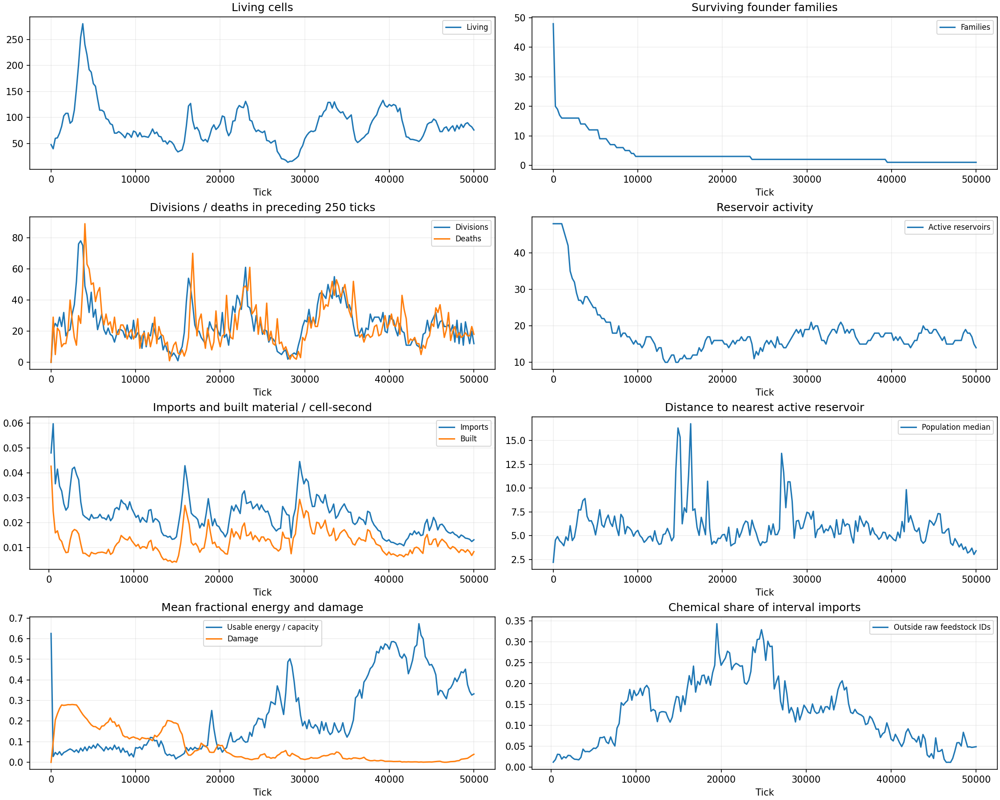
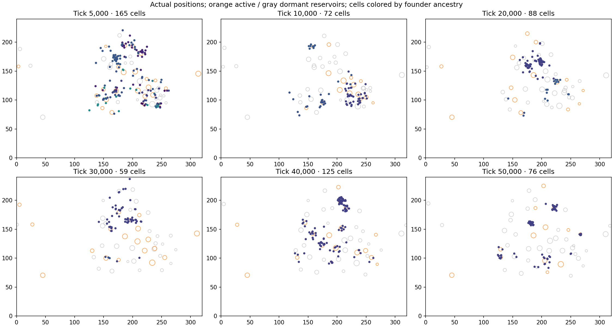
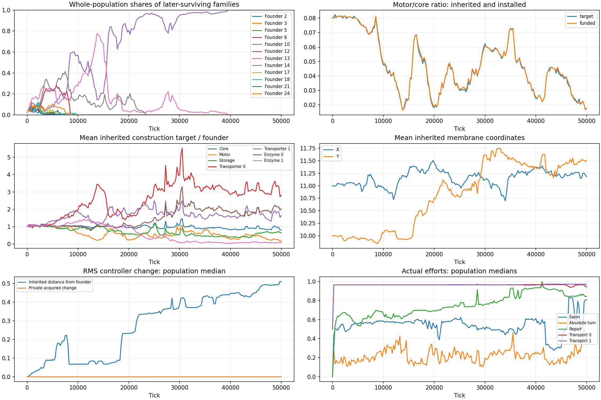
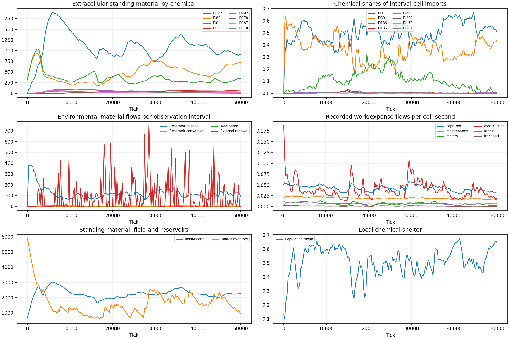

# Local-weathering trajectory: 50,000 ticks

September 17, 2026. Ledger **3989**, seed **27**, chemistry **101**, physical checkpoint **v18**.
The [registration](plans/archive/ENVIRONMENTAL-ECOLOGY-PLAN.md#weathering-50k) authorized one unchanged
default run, observations every 250 ticks and checkpoints every 2,500 ticks. No simulation
rules, mutation parameters, controllers or founders changed during this study.

## Main findings

The run completed all 50,000 ticks in **680.8 seconds**: 73.4 ticks/second including observation
and checkpoint work. It ended with **76 cells**, after **4,800 divisions** and **4,772 starvation
deaths**. Maximum living generation reached **158**. The sampled population peaked at 280.
There were repeated large declines and recoveries, with substantial inherited changes in
body allocation, chemical processing and controllers.

The successful descendants became cheaper to maintain and move, invested more heavily in
raw-feed transport, and changed their metabolic products. Biomass/byproduct reuptake became
substantial midway through the run, then declined despite increasing local availability.
That is a transient recycling opportunity, not a sustained food web. A nearly motorless branch
persisted for tens of thousands of ticks but eventually disappeared. Some other long-lived
mutants could not reproduce because their storage capacity was below the fixed fission requirement.

## Population turnover and ancestry

| Tick | Living cells | Whole-population composition |
| --- | ---: | --- |
| 3,750 | 280 | Largest sampled population |
| 5,000 | 165 | 12 founder families remain |
| 10,000 | 72 | Family 10: 41; family 13: 20; family 14: 11 |
| 15,000 | 34 | Family 10: 7; family 13: 23; family 14: 4 |
| 16,500 | 127 | Family 10: 107; family 13: 13; family 14: 7 |
| 23,000 | 131 | Family 10: 125; families 13 and 14: 3 each |
| 28,000 | 14 | Family 10: 12; family 13: 2 |
| 33,500 | 130 | Family 10: 127; family 13: 3 |
| 39,250 | 133 | Family 10: 131; family 13: 2 |
| 43,500 | 54 | Family 10 only |
| 50,000 | 76 | Family 10 only; all 76 have distinct sampled genome identities |

The 15,000–16,500 rebound is a replacement in population composition: family 10 rises from
7/34 (21%) to 107/127 (84%), while family 13 loses cells. Later rebounds occur mainly within
family 10. Family 14 ends at tick 23,367; family 13 ends at 39,387. These are founder ancestries,
not classifications of biological species or fixed strategies.

All endpoint cells descend from cell **2898**, one of the 34 cells alive at tick 15,000.
Their latest common ancestor, **3869**, was born at 20,160 and divided at 20,356. At 27,500,
two of the 20 living cells account for all endpoint descendants: cell 5282 contributes 56,
and 5286 contributes 20. Other branches continued living at those times. The second starting
colony was lost by tick 162; this did not prevent later movement and expansion among patches.



### What accompanies the crashes and rebounds?

Reproduction continues during declines. From 23,000 to 28,000 there are 348 divisions and
465 deaths; from 28,000 to 33,500 there are 635 divisions and 519 deaths. World extracellular
material rises from 2,034 to 2,228 units during that first decline, so the crash does not require
worldwide resource exhaustion.

The following rates divide cumulative flow by total living-cell time in each interval:

| Interval | Population | Imports / cell-second | Constructed material / cell-second | Captured work / cell-second |
| --- | --- | ---: | ---: | ---: |
| 12,000–15,000 | 78 → 34 | 0.01713 | 0.00675 | 0.03623 |
| 15,000–16,500 | 34 → 127 | 0.03305 | 0.01976 | 0.04915 |
| 23,000–28,000 | 131 → 14 | 0.02483 | 0.01346 | 0.04290 |
| 28,000–33,500 | 14 → 130 | 0.02938 | 0.01867 | 0.04989 |
| 39,250–43,500 | 133 → 54 | 0.01280 | 0.00759 | 0.03360 |

Access improves during the first two listed recoveries. Median distance to an active source
falls from 15.35 to 7.65 units during the first rebound and from 10.65 to 6.67 during the second.
Distance alone is insufficient: the later 39,250–43,500 crash happens while the median distance
falls from 5.32 to 4.48. Local concentration, competition, installed recognition, costs and
source timing matter beyond proximity to a source center.



## The inherited changes have physical expression

Population means at the endpoint, compared with the identical starting genotype:

| Construction target | Founder | Tick 50,000 mean | Change |
| --- | ---: | ---: | ---: |
| Core | 1.0000 | 0.8169 | −18% |
| Motor | 0.0800 | 0.01351 | −83% |
| Storage | 0.0800 | 0.05198 | −35% |
| Transporter slot 0, originally raw ID 0 | 0.0400 | 0.11226 | +181% |
| Transporter slot 1, originally raw ID 80 | 0.0400 | 0.06530 | +63% |
| Transporter slot 2, originally biomass ID 186 | 0.0400 | 0.00084 | −98% |
| Enzyme slot 0 | 0.0400 | 0.08130 | +103% |
| Enzyme slot 1 | 0.0400 | 0.00297 | −93% |
| Enzyme slot 2 | 0.0400 | 0.08947 | +124% |

The mean individual motor/core ratio falls from 0.0800 to 0.01774 in the targets and
**0.01789 in installed stocks**. The cheaper allocation is physically present. Installed
stock amounts vary with growth stage, so absolute funded stock should not be compared directly
with the founder's newborn target. Mean recognition-weighted target capacity for ID 0 rises
from 0.0400 to 0.09659; ID 80 falls slightly to 0.03697 despite increased slot-1 stock.
Chemical targeting changes what each unit of machinery can recognize.

Comparing 0–5,000 with 45,000–50,000, motor expense per cell-second falls **61%**, maintenance
**24%**, and repair expense **32%**. Imported material falls 47% and constructed material 14%.
Construction per imported unit rises from 0.393 to 0.633. These are realized population budgets,
not isolated genetic efficiency measurements. Mean damage falls from 0.174 at tick 5,000 to
0.039 at 50,000; exposure and occupied neighborhoods change too.

The controller also evolves: median inherited RMS distance from the founder reaches **0.510**.
The endpoint median private acquired change is 0.0000376; these measures cover different
parameter sets and do not partition the effect of learning. The raw-feed transport efforts remain
strong while repair and movement outputs change. Lower motor stock does not mean the RNN
stops requesting swimming.



### A motorless persistence branch, and sterile survivors

At 15,000, family 13 holds 23/34 cells and has effectively zero motor construction target.
Its funded motor/core ratio is 0.0008, compared with 0.0724 in family 10. It imports less per
cell-time, carries more damage, and thereafter reproduces very slowly: five divisions during
15,000–20,000, three during 20,000–30,000, and none afterward. Cell **2671**, born at 12,024,
survives until starvation at 39,387. Reduced investment supports long persistence here, but
this branch does not sustain its population or supply the major rebounds.

A separate constraint appears in family 10. Cell **4260**, born at 22,020, has ample work at
tick 33,250 but only **0.4335** inventory capacity; division requires **0.6** material. Its
inherited storage target is 0.00621, and its existing funded storage already exceeds twice
that target. Ordinary growth cannot raise storage enough with these unchanged alleles.
It survives until 48,707 without dividing. The same capacity check identifies **9/71** living
cells at 25,000 and **1/76** at 50,000 with an unattainable division capacity under their current
alleles. This is a consequence of mutable body targets meeting fixed birth requirements, not
evidence that all long-lived cells represent reproductively successful strategies.

## Chemistry: changed products, transient recycling

Shares of imported material, using interval differences across every recorded founder family,
including organisms that died during the interval:

| Interval | Raw ID 0 | Raw ID 80 | Biomass/byproduct ID 186 | Other chemicals |
| --- | ---: | ---: | ---: | ---: |
| 0–5,000 | 50.0% | 47.2% | 2.0% | 0.8% |
| 10,000–15,000 | 41.3% | 43.7% | 11.5% | 3.5% |
| 20,000–25,000 | 46.2% | 28.8% | 21.8% | 3.2% |
| 30,000–35,000 | 44.6% | 39.8% | 13.0% | 2.6% |
| 40,000–45,000 | 61.8% | 32.5% | 4.5% | 1.2% |
| 45,000–50,000 | 52.5% | 43.2% | 2.0% | 2.3% |

ID 186 reuptake is substantial: **1,951.7 material units** cumulatively. But only **0.5325 units**
of ID 186 enter recorded enzyme conversions. Most handling of this chemical therefore concerns
inventory, construction, repair, export or eventual death release, rather than another major
energy-producing reaction. Transport records identify chemicals, not whether a molecule came
from the same cell, a neighbor, a dead body or environmental conversion.

Reuptake declines while mean ID 186 concentration at occupied cells rises from **0.148 at
20,000 to 0.412 at 50,000**. The original biomass-import slot loses nearly all its stock and
other transporter targets move. That makes changing cellular machinery part of the explanation;
scarcity of ID 186 is not an adequate account of the late loss of recycling.

The main products change substantially. During 0–5,000, the two leading routes are
80→186 and 0→186. By 15,000–20,000, **0→178** is the largest route and remains largest in
every subsequent 5,000-tick interval. A large inherited step lies on the ancestry of every
endpoint cell: genome **1170**, born at tick **3,868**, changes enzyme-0's product Y offset
from **10.34775 to 2.16412**. Its parent is genome 937. The substrate target remains (0,0).
The resulting descendants produce a different part of chemical space, rather than merely
changing the rate of the founder's original transition. This is a concrete consequential
large mutation under the corrected mutation law; it does not by itself isolate its fitness effect.

Further processing of ID 178 occurs: 49.77 units consumed, with 178→203 and 178→219 the
largest outgoing routes. However, cells import only **0.5802 units** of 178 while producing
1,381.38 internally. Those totals support intracellular follow-on chemistry, not a major
cross-feeding pathway based on external 178. The endpoint still obtains **95.7% of imports
from raw IDs 0 and 80**.

The environment contains 194 chemical IDs above one-millionth of a material unit at the end,
but most standing material is concentrated: ID 186 holds 904 units, ID 80 holds 721 and ID 0
holds 348, out of 2,267 extracellular units. Chemical variety is much greater than diet variety.
Field weathering converts 639.41 cumulative units and reservoir processing 100.59; reservoir
release totals 24,227.20. External renewal adds **19,306.62** units over 6,650.36 initially
present. The run remains an open resource economy.



## Comparison and interpretation

The archived corrected-mutation run **3952** used the earlier environment. No comparison
simulation was rerun. Both trajectories use seed 27 and the corrected mutation method, but
multiple environmental rules differ, so this is a descriptive comparison.

| Measurement | Earlier environment, 3952 | Local weathering, 3989 |
| --- | ---: | ---: |
| Sampled peak / endpoint population | 100 / 32 | 280 / 76 |
| Divisions | 2,281 | 4,800 |
| Maximum living generation | 104 | 158 |
| Endpoint installed motor/core | 0.02339 | 0.01789 |
| Raw-feed share, final 5,000 ticks | 74.6% | 95.7% |
| ID 186 import share, final 5,000 ticks | 1.3% | 2.0% |

The earlier run obtained 20.3% of late imports from environmentally transformed ID 64.
This run supports more reproduction but less late dietary diversification. Its positive result
is ongoing inherited change, repeated recovery, and distinct allocation/metabolic outcomes.
It does not establish that the revised weathering causes those outcomes, or that a food web is
inevitable with more time. The earlier short local-medium probe remains the direct evidence
that local mixtures change the weathering response.

For the next work, these results make phenotype legibility useful: show funded allocation,
actual intake and products, and whether a surviving cell can still divide. Preserve the
mid-run recycling branch and the changed-product genomes as examples for any later targeted
comparison. This observation does not justify another mutation change, a prescribed recycling
specialist, or automatic tuning toward a desired community.

## Evidence, reproducibility and limits

- [Machine-readable findings](evidence/digital-chemistry/weathering-local-v18/50k/findings.json)
  retain interval flows, complete-family budgets, representative genomes, ancestral chemical
  steps and all-cell checkpoint summaries. Local raw archive:
  `frontend/harness/artifacts/weathering-local-50k-20260917/`.
- `main/` contains 201 observations, 7,908 sampled full genotypes, initial state, 20 numbered
  checkpoints and a duplicate terminal save. This is **21 distinct checkpoint positions**.
  Complete ancestry has 9,648 organism records. Genomes born and lost between observations
  can be absent from the sampled genotype file.
- `readout/` contains all-cell local chemistry, inventories, machinery, actions and private
  state at those 21 positions. Every restored checkpoint was byte-identical after observation;
  no ticks advanced. Full diagnostic frames remain in this offline study, outside the live
  browser message boundary.
- `report/report.json` holds the complete derived timeline. The existing report/findings
  readers reconcile population, imports, births, deaths and ancestry. Findings were also
  regenerated successfully from archived run 3952 without advancing simulation.
- Peak sampled process RSS: **406.1 MiB**; WASM: **205.6 MiB**. Full local study and derived
  artifacts occupy about **1.1 GiB**. Maximum absolute material residual: **5.11e-7**;
  reference-value residual: **9.33e-7**. Accounted numerical material loss totals 0.5763 units.
  This headless observation does not certify browser endurance or saturated-field performance.
- Exact executed WASM SHA256:
  `0a2f76ca81216fb70618ed64bb88b3ec7c8d232a04064e3bc1c6a39d4d099f21`.
  Kernel source digest:
  `b184c88d2eeab4eb44f630775a7c99bed7b80ae5d5920694565891618481db9d`.
  The source-change warning records concurrent display-name and offline-reader edits.
  No loaded simulation/observer code or kernel changed; the archived and current WASM hashes match.
- Validation: `make ci` passes 92 Rust and 60 Vitest tests, with 13 existing lint warnings.
  The Biotropy display name and native SVG dividing-cell favicon are separate presentation
  changes. The favicon was rendered and visually checked locally; deployment was not requested.

From `frontend`, regenerate readers into fresh output paths without rerunning the simulation:

```bash
python3 harness/seed_cycle_report.py harness/artifacts/weathering-local-50k-20260917/main harness/artifacts/weathering-local-50k-20260917/report-review
pnpm exec tsx harness/numerical/seedCycleReadout.ts harness/artifacts/weathering-local-50k-20260917/main harness/artifacts/weathering-local-50k-20260917/readout-review
python3 harness/seed_cycle_findings.py harness/artifacts/weathering-local-50k-20260917 harness/artifacts/weathering-local-50k-20260917/findings-review.json
```

The final command reads the original `report/` and `readout/` directories. Sampling can miss
brief population extrema. One unmodified trajectory establishes the reported events and
inherited differences; it does not isolate a trait's advantage from linked genes and geography.
