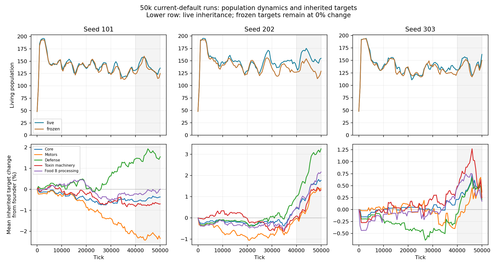

# Current-default 50,000-tick comparison

Registered September 11, 2026 before reading endpoints. Plan:
`d12c4609-52b6-49a8-b739-6f730dd13801`.

## Question and method

Does the current population remain ecologically dynamic, and does allowing inherited change alter
those dynamics relative to a population with the same initial genomes held fixed?

Seeds 101, 202 and 303 each run for 50,000 ticks in two arms. Live inheritance uses current
`DEFAULT_CONFIG`. Frozen inheritance changes only `mutationRate=0`, `physicalMutationRate=0` and
`learningRetention=0`. Private paid plastic learning remains active in both arms. Both start at
tick zero with identical bodies, placement, fields and random state within a seed. No saved winner,
authored strategy pair or ecological tuning enters either arm. This tests the combined contribution
of mutation and transmitted learning; it does not isolate either contribution.

The existing measurement loop samples every 500 ticks. It retains population/resource summaries,
recent-family and trait/effort projections, organism identities, and cumulative ledgers. Initial,
25,000-tick and final checkpoints support later inspection. Source digests must match before and
after each run. Each process has a 30-minute wall limit; extinction or the population safety limit
ends a run explicitly rather than being silently replaced with another seed.

Analysis emphasizes ticks 40,000–50,000: continued division and death, population replacement,
inherited trait distributions, sampled effort and ecological costs. Matrix coverage uses world area;
exposure uses sampled living cells; material expenditure uses absorbed material; energy uses
dissipated energy. Divisions/deaths are event counts, not population shares. Family branching also
occurs in the frozen arm and is not evidence of adaptation by itself.

Three seed pairs can reveal repeated patterns or contradictory outcomes. They cannot establish
indefinite dynamics, optimality, general adaptive benefit, or identify every winning mutation.

## Reproduction

From `frontend`, each run uses:

```bash
timeout 1800s pnpm exec tsx harness/lib/populationRun.ts --seed 101 --frozen false
```

Repeat for seeds 202 and 303 and `--frozen true`. Existing output directories are rejected;
provide a new `--output` directory to repeat the experiment without overwriting evidence.

```bash
python3 harness/population_report.py harness/artifacts/population-50k-2026-09-11
```

Artifacts are local under `frontend/harness/artifacts/population-50k-2026-09-11/`, with completed
runs also recorded in the existing SQLite ledger. No browser simulation or hosted reporting is used.

## Results

All six runs completed 50,000 ticks: 300,000 total, ledger rows 2943–2948. Each took 6.9–7.6
minutes while running concurrently. No extinction, safety-limit stop or source drift occurred.
The shared runtime digest was `461de09475c8d395543a27408668717afb9b5036e69a312f29439ab603e5fb8b`.
All three initial-world comparisons were identical except for the three declared configuration
settings, and external input matched at every sampled tick within each pair. Maximum sampled
accounting errors stayed below 8e-11% of energy input and 3e-11% of material input.

The following population means cover ticks 40,500–50,000 at 500-tick cadence. They are descriptive
paired outcomes, not independent repeated measurements or confidence intervals.

| Seed | Frozen mean population | Live mean population | Live change | Final population, frozen / live | Highest living generation, frozen / live |
| --- | ---: | ---: | ---: | ---: | ---: |
| 101 | 134.75 | 140.10 | +3.97% | 125 / 136 | 8 / 10 |
| 202 | 134.65 | 156.15 | +15.97% | 129 / 155 | 8 / 12 |
| 303 | 136.95 | 142.05 | +3.72% | 150 / 162 | 9 / 12 |

Live populations exceeded their controls at 85%, 100% and 75% of late samples respectively.
Late population correlations were 0.91, 0.83 and 0.92: inherited change altered outcomes while
both arms still shared much of the ecological rise/fall pattern.



The lower chart shows absolute inherited stock targets, which also change when the core target
changes. It does not equate motor target with speed or motor allocation. Core-normalized motor
investment averaged 7.84%, 7.97% and 8.00% in the live runs, versus the founder's 8.00%. Mean
A-processing allocation remained 61.27–61.70% of total processing, near the founder's 61.54%.
These observations do not establish separate fast/slow or A/B-specialist populations.

## Continuing dynamics and ecological consequences

The world did not freeze into an unchanged set of organisms. During the final 10,000 ticks,
live populations had 65/108/121 divisions and 61/90/90 deaths for seeds 101/202/303. Frozen
populations had 65/66/107 divisions and 64/64/84 deaths. At tick 50,000, 71–96% of living cells
in the live arm and 80–97% in the frozen arm had been born after tick 40,000. Stable abundance
therefore coexisted with substantial replacement even without inherited sequence change.

The strongest difference was seed 202. Its live population's leading founder reached 80% of
living cells, versus 13.2% in the frozen control. The other live leaders reached 22.1% and 37.7%,
versus 11.2% and 17.3%. These are founder ancestry shares, not inferred strategies or proof of
adaptation on their own.

All percentages below use *late-window flows*, not lifetime secretion divided by current area.

| Seed | Toxin / absorbed material, frozen / live | Repair / dissipated energy, frozen / live | Matrix / absorbed material, frozen / live |
| --- | ---: | ---: | ---: |
| 101 | 1.97% / 1.70% | 9.60% / 8.50% | 4.12% / 3.60% |
| 202 | 1.98% / 0.82% | 10.45% / 3.44% | 4.26% / 3.86% |
| 303 | 2.38% / 2.07% | 11.87% / 10.86% | 5.30% / 4.77% |

Zero deaths were directly classified as damage deaths. Damage was still consequential as an
energy expense; attributing individual starvation deaths to damage would require an intervention.
In seed 202, lower repair coincided with higher construction yield: 7.35% versus 5.21% of absorbed
material became structure. Reduced toxin expenditure and repair are a plausible explanation for
the improved population/reproductive outcome; this panel does not isolate the responsible genes.

Matrix occupied only 0.074–0.254% of world area at the half-speed threshold in the live runs,
averaged over late samples. Yet 8.4–17.5% of sampled living cells experienced at least 20% slowing.
The frozen controls showed the same distinction: 0.096–0.308% of world area, but 9.8–19.1% of cells
slowed. Matrix is spatially localized and encounters matter more than global coverage. This panel
does not establish that constructing it benefits its producers; prior binding ablations address a
different, causal question. Neutral signaling remains intentionally disabled.

## Conclusions and next decision

1. **Inherited change matters in this panel.** All three live populations achieved higher late
   abundance with identical external input and higher final generation depth. Seed 202 offers
   the clearest evidence of improved population performance. Three seeds support a working
   conclusion of beneficial inherited change, not a universal or indefinite adaptive advantage.
2. **Ecological turnover is already sustained over 50,000 ticks.** Much of the visible population
   fluctuation also occurs with one fixed genotype. Motion, replacement and family turnover must
   not be treated as evolutionary discoveries.
3. **Broad strategy differentiation remains unestablished.** The repeated pattern is lower toxin
   and repair expenditure alongside ancestry concentration. Economy improvements appear more
   prominent than new physical specializations. Absolute mean construction targets changed by
   approximately -2.34% to +3.25%; many core-normalized medians remained at founder values.
4. **The family display can overstate diversity.** Frozen populations contained exactly one
   inherited sequence but 65–85 recent ancestry families. Live populations contained 134–158
   sequences and 89–104 families. Those counts describe different things; neither counts strategies.
   Four-generation grouping also subdivides an 80%-dominant founder into many small colors.

The next ecological question is whether an economical dominant population leaves opportunities
for a different heritable behavior to spread, or whether selection is exhausting an initial costly
secretion reflex. That question is more useful than explaining every winner or extending runtime
solely to obtain more colors. Review any proposed ecological change against that opportunity;
do not force coexistence, inject a preferred strategy or prescribe a successful motor pair.

`make ci` passed all 78 bounded tests for the measurement addition. The analysis reads completed
artifacts and produces local JSON and a static plot. No production physics, controller, inheritance
setting or browser default was changed by this experiment.
