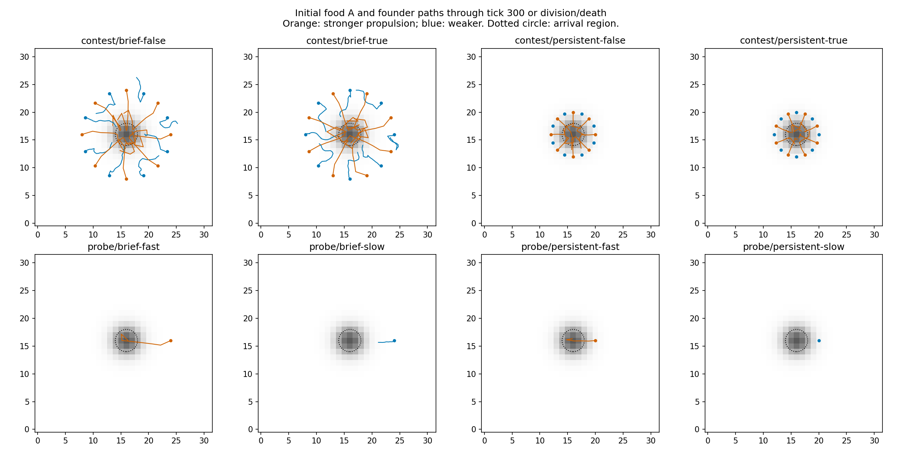

# Short food-access experiment

Registered September 11, 2026, before execution. Plan
`f9255235-8c5b-4b1d-b8a5-60ecd2dbe0c5`.

## Question and budget

Can stronger propulsion obtain food that weaker propulsion misses, and does that access repay
movement expenditure? Does weaker propulsion instead pay near persistent food? This tests
constructed strategic opportunity, not evolutionary discovery or stable coexistence.

Four single-founder probes run for at most 300 ticks each. Inspect local sensor contrasts,
turning, displacement and uptake before running four contests of at most 3,000 ticks each.
Each contest begins with eight cells per genotype; the two assignments swap identical starting
slots. One seed, 701, screens mechanisms rather than estimating an across-seed effect.
Each case has a 120-second wall cap. There is no automatic horizon extension, replication or
parameter search. Failure to detect or use a gradient is a result; it does not authorize tuning.

## Declared setup

The shared 32 by 32 periodic runtime starts with 96 units of food A in a Gaussian patch centered
at (16,16), sigma 2. There is no background food or replenishment. Source inventory is equal
across contexts. Initial cells occupy equally spaced ring positions and face 45 degrees away
from inward, requiring steering. Single-cell probes use the first ring slot.

| Context | Starting radius | Edible-food decay half-life |
| --- | --- | --- |
| Local persistent | 4 cells | About 3,466 ticks, the production decay rate |
| Distant brief | 8 cells | 120 ticks |

These are deliberately bundled opportunity contexts. A difference between them cannot isolate
distance from food lifetime. Gaussian food tails are edible and locally sensed; arrival within
two cells of the center is recorded separately from first uptake. Recycled material remains
food B and is reported separately. Nutrient decay includes A and recycled B, with offered A as
the explicit reporting denominator; it is not an exact A-only loss fraction.

Both genotypes use existing `travelGenome` RNNs: propulsion logit bias 1 versus 0.15, with identical
chemotactic steering, nutrient-dependent slowing and physical genomes. Actual initial bodies and
reserves match. Toxin, matrix and neutral signal outputs are suppressed through diagnostic weights.
Mutation, private plastic learning and learned-weight retention are disabled. All uptake, growth,
division, diffusion, contacts and movement use production physics. No oracle or external controller
chooses an action. These genotypes are never promoted into the default population automatically.

## Evidence and interpretation

Read the causal chain: local contrast → turning and displacement → arrival/uptake → movement
expense versus absorbed energy → funded growth/divisions. Initial food-A capture is a percentage
of the offered inventory; motor expenditure is a percentage of absorbed A+B energy. Births and
divisions have initial-cell denominators; fission births are not net population gain. Raw typed
flow totals remain in artifacts for calculations, not as stand-alone claims of importance.

Ten-tick traces retain positions, actions, input vectors and nonmutating current-position sensor
probes. Inputs/actions describe the preceding inference, while positions describe the frame tick.
Source digests, full initial/final checkpoints, resolved settings, stopping reasons and conservation
residuals accompany each case. The existing SQLite ledger indexes results. A source hash change
invalidates interpretation. A wall cap is incomplete evidence, not a completed horizon.

The first useful result may be a missing sensor signal, wrong steering, excessive propulsion cost,
or no additional uptake despite earlier arrival. Do not run a long competition to obscure that
finding. If both strategies have conditional benefits, next assess whether accessible inherited
changes can exploit the opportunity. No crossover is required to accept a negative result.

## Commands

From `frontend`, use a new output directory for each execution; existing case directories are
never overwritten:

```bash
pnpm harness quick-food-access --stage probe --output harness/artifacts/quick-food-2026-09-11/probe
pnpm harness quick-food-access --stage contest --output harness/artifacts/quick-food-2026-09-11/contest
```

Run and inspect probes before the contest command. `--seed` chooses one seed; `--ticks` accepts
1–3,000 ticks and changes the registered horizon, so record the reason. The generic `QuickScenario`
contract supplies a fixture factory, target, inventory and explicit hypothesis/specification;
`runQuick` owns bounded execution, observations and evidence. New feature experiments should add
fixtures and targeted observations here instead of creating another campaign pipeline.

## Results

All eight cases finished without a wall cap or source change. Four probes ran 300 ticks, two
persistent contests reached 3,000, and the brief contests ended naturally in whole-population
extinction at 2,869/2,585. Total: **12,654 world ticks in 12.33 seconds of simulation execution**,
excluding development, checks, process startup and plotting. SQLite rows 3021–3028; artifacts
`frontend/harness/artifacts/quick-food-2026-09-11/`.

The probes identify the sensor/action chain. At initial radius eight, local A left contrast is
0.00464; the stronger-propulsion cell steers inward and enters the radius-two region at tick 42.
The weaker cell advances from radius eight to about 7.4, then food-dependent slowing reduces its
swimming effort to zero by tick 40. It never enters the arrival region within the 300-tick probe.
In the persistent probe, weaker swimming is zero near the initial radius four while stronger
propulsion reaches the arrival region at tick 17. Gaussian tails allow uptake from tick zero in
every case; first nonzero uptake is therefore not a useful food-discovery metric in this fixture.

| Contest context | Food A captured, stronger / weaker | Motors as % of absorbed A+B energy, stronger / weaker | Divisions per founder, stronger / weaker | Terminal living, stronger / weaker |
| --- | --- | --- | --- | --- |
| Local persistent, both assignments | 54.83–55.53% / 41.39–42.13% | 23.27–23.41% / 1.94–2.10% | 1 / 1 | 0 / 14–16 at tick 3,000 |
| Distant brief, both assignments | 35.48–35.50% / 8.64–8.66% | 24.12–24.19% / 3.88–3.91% | 1 / 0 | 0 / 0 at extinction |

Stronger swimming reaches brief food soon enough to fund reproduction that the weaker variant
does not achieve. All stronger founders arrive by tick 45 in the brief contests. Only 37.5–50%
of weaker founders ever arrive, at ticks 307–569, after more than two decay half-lives.
Near persistent food, additional capture does not yield additional divisions; the weaker
population persists with much lower movement expenditure. It also consumes recycled B: about
37% of its absorbed material is B, versus less than 0.04% for stronger swimmers there. Thus later
survival includes resource recycling and spatial residence, not solely motor savings.

This establishes context-dependent consequences of a constructed behavioral choice. It does
**not** show a reproductive winner reversal in both contexts: divisions tie in the persistent
case, and both populations ultimately exhaust the brief meal. It does not show a high-motor-body
niche, evolved specialization, coexistence, or an indefinitely sustainable world. The prior physical
motor-investment experiment remains a separate negative result. Single-probe capture includes
descendant uptake and must not be described as uptake by the original cell alone.

The short test identifies a useful next question: can local food-dependent propulsion regulation
retain early access while reducing post-feeding expenditure? A small weight intervention and
the same fixtures can test that before any mutation-discovery campaign. No such intervention,
extra seed panel or production change was run here.



Paths show the initial founders only, through tick 300 or their earlier division/death; ten-tick
segments do not certify smooth motion. Source hash during every case:
`1dbe2247238bb682f9729d10f8c1581eae3f0d0548e19a43863bb56489370bef`.
Maximum per-step energy/material residuals are below 2.25e-11% / 8.05e-13% of initial budgets.
Subsequent harness cleanup omits absent groups from summaries; formatting and reporting changed
no simulation mechanics. The current Run default and founder remain unchanged.
